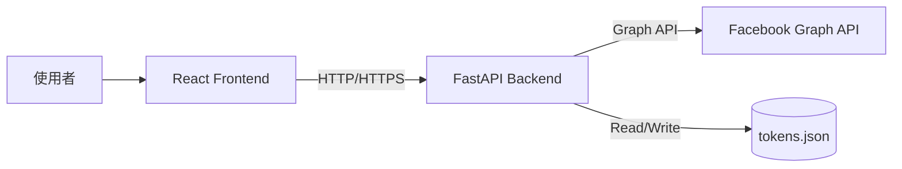

# Facebook Dashboard Web App - 專案規格書 (Project Specification)

## 1. 專案概述 (Project Overview)
本專案為一個 Facebook 廣告數據儀表板，旨在提供使用者一個簡單的介面來查看其 Facebook 廣告帳號的關鍵績效指標 (KPI) 和趨勢圖表。系統包含前端網頁介面與後端 API 服務，並支援多語系 (繁體中文/英文)。

## 2. 技術架構 (Tech Stack)

### 前端 (Frontend)
- **框架**: React 18
- **建置工具**: Vite
- **語言**: JavaScript (ES6+)
- **樣式**: CSS Modules / Inline Styles (搭配 Glassmorphism 設計風格)
- **圖表庫**: Recharts
- **部署**: Zeabur (Static Site)

### 後端 (Backend)
- **框架**: FastAPI (Python 3.9+)
- **伺服器**: Uvicorn
- **HTTP 請求**: Requests
- **資料儲存**: 本地 JSON 檔案 (`tokens.json`) 用於儲存 Access Token (簡單實作)
- **部署**: Zeabur (Dockerized Python App)

## 3. 系統架構 (System Architecture)



## 4. 功能列表 (Features)

### 4.1 認證與授權 (Authentication)
- **Token 交換**: 使用者輸入 App ID, App Secret 和 Short-Lived Token，後端將其交換為 Long-Lived Token (效期 60 天) 並儲存。
- **安全性**: Token 儲存於後端 `tokens.json` (需注意此檔案不應提交至 Git)。

### 4.2 廣告帳號管理 (Ad Account Management)
- **帳號列表**: 自動抓取使用者權限下的所有廣告帳號。
- **帳號切換**: 支援在前端下拉選單切換不同廣告帳號，即時更新數據。

### 4.3 數據儀表板 (Dashboard)
- **KPI 卡片**: 顯示最近 30 天的關鍵指標：
  - 花費 (Spend)
  - 曝光數 (Impressions)
  - 點擊數 (Clicks)
  - 觸及數 (Reach)
- **趨勢圖表**: 顯示過去一年的每月數據趨勢 (折線圖)。
  - 目前對應：Spend -> Followers (暫代), Clicks -> Engagement (暫代)。

### 4.4 系統設定
- **多語系**: 支援繁體中文 (zh) 與英文 (en) 切換。
- **部署支援**: 支援環境變數 `VITE_API_URL` 設定後端位址，解決跨域與部署連線問題。

## 5. API 規格 (API Endpoints)

| Method | Endpoint | Description | Parameters |
| :--- | :--- | :--- | :--- |
| `GET` | `/` | Health Check | None |
| `POST` | `/api/auth/exchange-token` | 交換並儲存 Long-Lived Token | `app_id`, `app_secret`, `short_token` |
| `GET` | `/api/ad-accounts` | 取得所有廣告帳號列表 | None |
| `GET` | `/api/dashboard-data` | 取得特定帳號的 KPI 與圖表數據 | `account_id` (Query Param) |

## 6. 資料結構 (Data Structures)

### 6.1 Dashboard Data Response
```json
{
  "source": "real",
  "account_id": "act_123456",
  "kpi": [
    { "label": "Spend (30d)", "value": "$1,234.56", "change": "---", "isPositive": true },
    ...
  ],
  "chart_data": [
    { "name": "2023-01", "followers": 150.0, "engagement": 20 },
    ...
  ]
}
```

## 7. 部署與環境變數 (Deployment & Env)

### Frontend (`.env.production`)
- `VITE_API_URL`: 後端 API 的完整網址 (必須包含 `https://`)。

### Backend
- 依賴 `tokens.json` 運作，部署時需注意 Volume 掛載或重新認證 (因 Zeabur 重新部署會清除容器內檔案，建議未來改用資料庫或 Persistent Volume)。

## 8. 待優化項目 (Future Improvements)
- [ ] **Token 持久化**: 將 `tokens.json` 改為資料庫儲存 (如 PostgreSQL/SQLite) 以避免重啟後遺失。
- [ ] **圖表欄位修正**: 前端圖表目前顯示 "Followers/Engagement"，但後端回傳的是 "Spend/Clicks"，需統一命名。
- [ ] **錯誤處理**: 增強 API 錯誤回傳的詳細度與前端提示。
