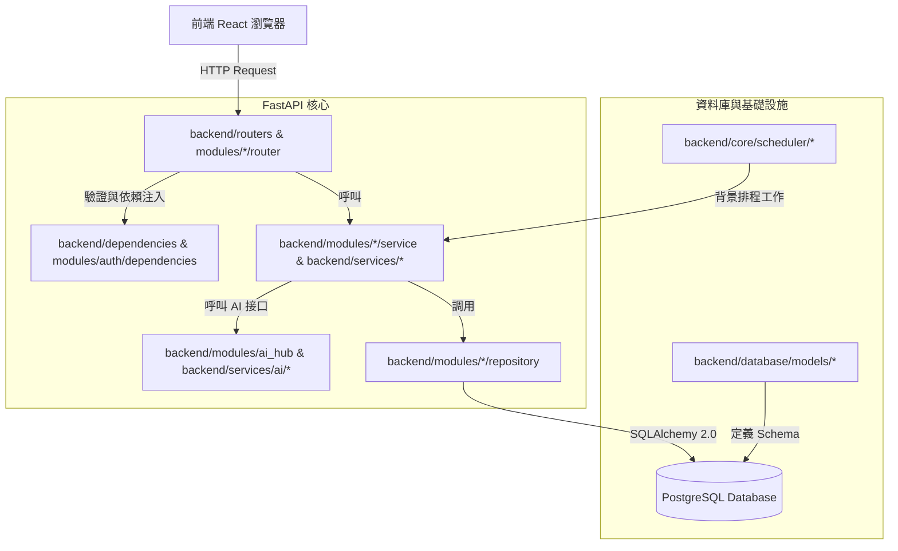
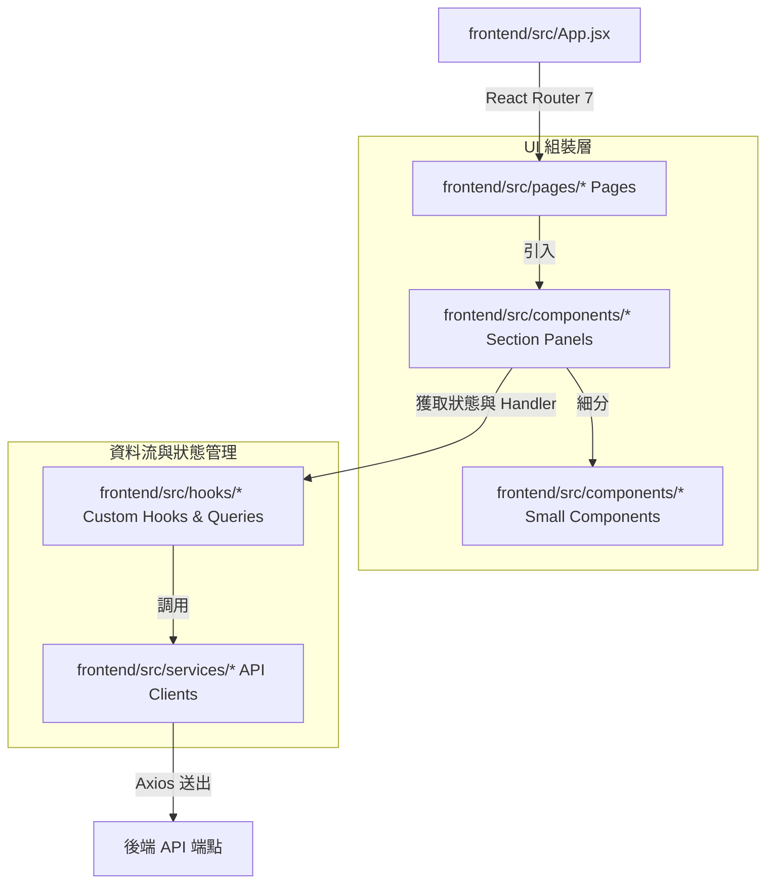

# DataVue 專案現況架構與程式碼行數統計

> **文件定位**：本文件是 2026-08-11 重新盤點的「現況快照」，取代 docs/31、docs/36 中已過時的行數與部分檔案路徑資訊，作為往後查詢專案現況架構與程式碼規模的**首要參考來源**。docs/31、docs/36 的歷史拆分實作記錄與決策脈絡仍具參考價值，予以保留，不另行改寫。

---

## 一、系統總覽

DataVue 是一套跨平台數位行銷數據分析與 AI 輔助決策平台，整合 Meta (Facebook) Ads、Google Analytics 4 (GA4)、Google Search Console (GSC) 數據，並提供 Meta Andromeda（廣告素材 AI 評分）與 MMM（行銷貢獻衡量）兩套 AI/統計模型模組。

### 技術棧（依 2026-08-11 `package.json` / `requirements.txt` 核對）

| 層級 | 技術 | 版本 |
| :--- | :--- | :--- |
| 前端框架 | React | ^19.2.0 |
| 前端建構 | Vite | ^7.2.4 |
| 前端路由 | react-router-dom | ^7.10.1 |
| 前端資料層 | @tanstack/react-query | ^5.90.21 |
| 前端型別 | TypeScript（漸進導入，P2-2） | ~6.0.3 |
| 後端框架 | FastAPI | >=0.115,<0.116 |
| ORM | SQLAlchemy | >=2.0,<3.0 |
| 資料庫遷移 | Alembic | >=1.14,<2.0 |
| 資料驗證 | Pydantic | >=2.10,<3.0 |
| 排程 | APScheduler | >=3.11,<4.0 |
| 快取/佇列 | Redis | >=5.2,<6.0 |
| 部署平台 | Zeabur（backend / frontend / Meta Andromeda 獨立 worker 三服務） | — |

### 部署架構要點

backend 與 Meta Andromeda 素材 worker 已於 2026-07-13 起採用 **Option D（worker 集中化儲存）** 為正式生產架構（見 [10_Zeabur_部署與持久化儲存設定指南.md §2.4](10_Zeabur_部署與持久化儲存設定指南.md)、[docs/28](../03_meta_andromeda/28_Meta_Andromeda_素材縮圖跨容器儲存問題與Worker集中化方案規劃.md)）：backend 以 HMAC 簽章代理 upload/preview 請求到 worker 內部端點，worker 獨立持有素材 volume，backend 容器本身不再落地儲存縮圖。worker 與 backend 同源於本倉庫（`backend/modules/meta_andromeda/internal_router.py`、`internal_asset_gateway.py` 等），以不同部署設定啟動，並非獨立目錄的第二個專案。

---

## 二、專案目錄結構（現況）

```
DataVue-App/
├── backend/                       # 後端 FastAPI 專案
│   ├── alembic/versions/          # 資料庫遷移歷史（43 檔）
│   ├── core/                      # 跨模組基礎設施：config、security、startup、exceptions
│   │   └── scheduler/             # 統一背景排程（GA4/Andromeda/報表等 cron job）
│   ├── database/                  # DB 連線設定與 SQLAlchemy models
│   ├── modules/                   # 業務功能模組（14 個，以功能邊界分割）
│   │   ├── admin/                 # 後台管理
│   │   ├── ai_hub/                # AI 接口服務（OpenRouter/Zeabur AI Hub/Gemini）
│   │   ├── auth/                  # 使用者認證、Token 加密管理
│   │   ├── contribution/          # MMM 廣告活動貢獻衡量
│   │   ├── fb_ads/                # Facebook Ads 數據讀取與 KPI 處理
│   │   ├── ga4/                   # GA4 數據讀取、即時洞察（insights/ 子套件）
│   │   ├── gsc/                   # Search Console 數據讀取與 OAuth
│   │   ├── line/                  # LINE 告警推播
│   │   ├── meta_andromeda/        # 核心 AI 評分模組（router/service/repository 套件化）
│   │   ├── permissions/           # 模組級權限（RBAC + ABAC）
│   │   ├── reports/                # 週報產生與檢視
│   │   ├── saved_views/           # 已儲存分析視圖
│   │   ├── teams/                 # 多租戶團隊管理
│   │   └── users/                 # 使用者管理
│   ├── routers/                   # 既有相容層路由（analytics_ai、debug，已大幅精簡）
│   ├── services/                  # 既有相容層服務（facebook_service 等 legacy shim、ai/*、line/report/user/permission）
│   ├── scripts/                   # 維運與資料校驗腳本
│   └── tests/ , tests/meta_andromeda/  # 單元測試與整合測試
├── docs/                          # 專案規劃與技術文件
├── frontend/                      # 前端 React 19 專案
│   └── src/
│       ├── components/            # 功能元件（依模組分子目錄：GA4、GA4Insights、GSC、
│       │                          #   MetaAndromeda、Contribution、Analytics、Reports、
│       │                          #   Admin、Settings、MetricsManager）
│       ├── constants/             # 全域常數與指標註冊表
│       ├── hooks/                 # 業務與 API 資料流 Custom Hooks（23 個）
│       ├── pages/                 # 路由頁面（組合層，大多 <400 行）
│       ├── services/              # Axios API Clients（含 apiClient.ts，P2-2 已轉 TS）
│       ├── types/                 # TypeScript 型別（P2-2 新增，漸進導入中）
│       └── utils/                 # 通用工具（auth.ts 等）
└── scripts/                       # 根目錄自動化驗證腳本（含 source_stats.ps1）
```

---

## 三、程式碼行數統計（2026-08-11 重新產出）

**統計方法**：`scripts/validation/source_stats.ps1`（`git ls-files --cached --others --exclude-standard`，副檔名 `.py .js .jsx .ts .tsx .css .ps1`，排除 `docs/`、`node_modules/`、`dist/`、`.tmp/`、`.vite/`、cache 目錄與 lockfile；不含 `.md` 文件檔）。

### 3.1 整體概況

| 指標 | 數值 |
| :--- | :---: |
| 總檔案數 | **568** |
| 總程式碼行數 | **111,297** |

| 區塊 | 檔案數 | 行數 | 佔比 |
| :--- | :---: | :---: | :---: |
| backend | 299 | 62,670 | 56.3% |
| frontend | 264 | 47,854 | 43.0% |
| 根目錄/腳本 (root/scripts) | 5 | 773 | 0.7% |
| **總計** | **568** | **111,297** | **100%** |

> 對照上一次統計（docs/31，2026-07-17）：492 檔／96,252 行 → 現況 568 檔／111,297 行，成長 76 檔／+15,045 行（約 +15.6%）。成長主要來自本 session 新增的後端/前端測試檔（P2-3，約 +61 個測試檔）、TypeScript 基礎建設與轉檔（P2-2）、以及 GA4/Andromeda/Contribution 模組間的持續功能擴充。

### 3.2 依模組/目錄細分（行數由高至低）

| 目錄 | 行數 | 檔案數 | 說明 |
| :--- | ---: | ---: | :--- |
| `backend/tests` | 17,962 | 53 | 後端單元/整合測試（不含 `tests/meta_andromeda/` 子目錄，見下） |
| `backend/modules/meta_andromeda` | 12,127 | 52 | 核心 AI 評分模組（router/service/repository 已套件化，見 3.3） |
| `frontend/src/pages` | 7,943 | 36 | 路由頁面組合層 |
| `frontend/src/hooks` | 7,125 | 50 | Custom Hooks（含各頁 `__tests__`） |
| `frontend/src/components`（頂層，無子目錄） | 5,891 | 24 | 共用元件（Header、Sidebar、SettingsModal 等） |
| `backend/modules/ga4` | 4,745 | 21 | GA4 數據讀取與即時洞察 |
| `frontend/src/components/MetaAndromeda` | 4,491 | 22 | Andromeda 前端子元件 |
| `backend/alembic` | 4,468 | 43 | 資料庫遷移歷史 |
| `frontend/src/components/GA4Insights` | 3,510 | 10 | GA4 洞察頁子元件 |
| `frontend/src/components/Analytics` | 3,402 | 16 | 成效分析頁子元件 |
| `backend/modules/contribution` | 3,388 | 9 | MMM 貢獻衡量模組 |
| `frontend/src/components/GSC` | 3,243 | 15 | GSC 報表子元件 |
| `backend/scripts` | 3,170 | 15 | 維運/校驗腳本 |
| `frontend/src/components/GA4` | 3,052 | 14 | GA4 報表子元件 |
| `backend/services` | 2,848 | 12 | 既有相容層服務 |
| `backend/core` | 2,439 | 14 | 跨模組基礎設施 |
| `backend/modules/fb_ads` | 1,840 | 11 | Facebook Ads 數據處理 |
| `frontend/src/components/Reports` | 1,747 | 14 | 週報子元件 |
| `frontend/src/components/Contribution` | 1,719 | 9 | MMM 前端子元件 |
| `backend/database` | 1,586 | 15 | DB 連線設定與 models |
| `frontend/src/services` | 1,387 | 17 | API Clients（含測試） |
| `backend/modules/gsc` | 1,155 | 3 | GSC 讀取與 OAuth |
| `backend/modules/ai_hub` | 922 | 8 | AI 接口服務 |
| `backend/modules/auth` | 913 | 4 | 認證與 Token 加密 |
| `frontend/src/utils` | 883 | 6 | 通用工具 |
| `frontend/src/components/Settings` | 866 | 6 | 設定相關子元件 |
| `frontend/src/constants` | 840 | 3 | 全域常數/指標註冊表 |
| `frontend/src/components/Admin` | 547 | 6 | 後台管理子元件 |
| `backend/modules/reports` | 516 | 2 | 週報產生 |
| `backend/service_modules` | 456 | 3 | 其他服務模組 |
| `backend/main.py` | 440 | 1 | 後端啟動點 |
| `backend/modules/teams` | 400 | 3 | 團隊管理 |
| `frontend/src/components/MetricsManager` | 345 | 5 | 指標管理器子元件 |
| `backend/routers` | 339 | 2 | 既有相容層路由（大幅精簡後僅剩 2 檔） |
| `backend/modules/permissions` | 305 | 2 | 模組級權限 |
| `backend/modules/saved_views` | 250 | 2 | 已儲存分析視圖 |
| `backend/modules/admin` | 213 | 2 | 後台管理（後端） |
| `frontend/src/types` | 134 | 1 | TypeScript 型別（P2-2 新增） |
| `backend/modules/users` | 112 | 2 | 使用者管理 |
| `backend/modules/line` | 95 | 2 | LINE 告警推播 |
| 其餘（`backend/*.py` 根層工具腳本、`frontend/src/(other)` 等） | ~1,000 | ~15 | 個別小型工具檔 |

> `backend/modules/meta_andromeda` 是目前單一最大模組（12,127 行 / 52 檔），已是套件化拆分後的規模；細部見下方 3.3。

### 3.3 Meta Andromeda 模組內部拆分現況

該模組已完成 docs/31 記錄的多波拆分，`router.py`／`service.py`／`repository.py` 三個原本的巨型檔案皆已改為套件：

| 子套件 | 檔案數 | 總行數 | 最大單檔 |
| :--- | ---: | ---: | :--- |
| `meta_andromeda/router/` | 8 | 1,042 | `monitoring.py`（232 行） |
| `meta_andromeda/service/` | 7 | 2,137 | `admin_ops.py`（704 行） |
| `meta_andromeda/repository/` | 12 | 3,296 | `release.py`（492 行） |
| 模組根層其餘檔案（`runtime.py`、`schemas.py`、`calibration_pipeline.py`、`importers/` 等） | 25 | 5,652 | `schemas.py`（717 行，純 Pydantic 宣告） |

### 3.4 現況最大 20 個原始碼檔案

| 檔案 | 行數 | 分類 |
| :--- | ---: | :--- |
| `backend/tests/meta_andromeda/test_observation_import.py` | 1,677 | 測試 |
| `backend/scripts/maintenance/main_legacy.py` | 1,553 | Legacy 維運腳本（保留供參照） |
| `backend/tests/meta_andromeda/test_scoring_pipeline.py` | 1,102 | 測試 |
| `frontend/src/components/GSC/RegularDataTab.jsx` | 1,073 | 前端元件 |
| `backend/tests/test_contribution_module.py` | 945 | 測試 |
| `backend/tests/test_contribution_service.py` | 900 | 測試 |
| `frontend/src/components/GA4Insights/GA4InsightsShared.jsx` | 894 | 前端共用元件 |
| `backend/modules/ga4/insights_router.py` | 881 | 後端路由 |
| `backend/tests/test_ga4_landing_page_rules.py` | 798 | 測試 |
| `backend/modules/gsc/router.py` | 783 | 後端路由 |
| `backend/tests/test_ga4_insights_wave2.py` | 779 | 測試 |
| `backend/modules/contribution/service.py` | 760 | 後端服務 |
| `frontend/src/pages/__tests__/ContributionAnalysis.test.jsx` | 734 | 測試 |
| `backend/tests/meta_andromeda/test_drift_calibration.py` | 729 | 測試 |
| `frontend/src/components/MetaAndromeda/release/ReleaseOverviewContent.jsx` | 720 | 前端元件 |
| `backend/tests/meta_andromeda/test_release_backtest.py` | 718 | 測試 |
| `backend/modules/meta_andromeda/schemas.py` | 717 | 後端 Pydantic 宣告 |
| `backend/modules/meta_andromeda/service/admin_ops.py` | 704 | 後端服務 |
| `backend/modules/contribution/router.py` | 688 | 後端路由 |
| `backend/modules/meta_andromeda/service/observation_import.py` | 671 | 後端服務 |

> 完整 Top 60 清單見同批產出的 `scripts/validation/source_stats.ps1 -Top 60` 原始輸出（未另存檔，可重跑指令取得）。測試檔、legacy snapshot、純 Pydantic 宣告檔依 docs/31 既定門檻列為可接受例外，不視為待拆缺口。

> **與 docs/31/36 記錄的落差**：`backend/routers/gsc.py`（docs/36 記載 639 行）與 `frontend/src/pages/Analytics.jsx`（docs/31/36 記載 946 行）等檔案在現況統計中已不存在或大幅縮減 —— GSC 路由已搬遷至 `backend/modules/gsc/router.py`（現 783 行），`Analytics.jsx` 已進一步瘦身至 246 行，`GA4Insights.jsx` 瘦身至 391 行。代表 docs/31/36 所述的部分「大型檔案拆分」後續仍有增量調整未回寫舊文件，本文件以現況為準。

---

## 四、核心業務模組數據流（現況核對，沿用 docs/36 圖示，架構未變）

### 4.1 後端請求流



### 4.2 前端資料流



### 4.3 三大 AI/統計模組資料鏈（現況一致，未變動）

- **Meta Andromeda（AI 素材評分）**：`Facebook Ads 觀測匯入（observation_import）` ➔ `特徵工程/heuristic` ➔ `模型評分管線（calibration_pipeline）` ➔ `Review Queue 審查隊列` ➔ `專家標註` ➔ `自適應校準（feedback_calibration）` ➔ `素材縮圖經 Option D worker 代理儲存/預覽`。
- **GA4 轉換與即時洞察**：`GA4 API 獲取資料` ➔ `insights/ 子套件分類規則（landing_pages/items/channels）` ➔ `異常偵測（anomaly_rules）` ➔ `LINE Alert 推播 / AI 摘要生成` ➔ `快照分享凍結副本（docs/61）`。
- **MMM 貢獻衡量**：`contribution/service.py` 資料來源彙整 ➔ `contribution/engine.py` 邊際貢獻運算 ➔ `contribution/repository.py` 落地 ➔ `contribution/router.py` 對前端輸出。
- **GSC 搜尋外觀分析**：`modules/gsc/service.py`（OAuth/資料讀取） ➔ `modules/gsc/router.py` 端點輸出 ➔ 前端 `GSCStats.jsx` 組合層與 `GSC/*` 子元件展示。

---

## 五、相關文件索引

| 主題 | 文件 | 定位 |
| :--- | :--- | :--- |
| 大型檔案拆分歷史與實作細節 | [31_專案原始碼架構與關聯分析.md](31_專案原始碼架構與關聯分析.md) | 歷史記錄，行數已過時，拆分方案與驗證方式仍具參考價值 |
| 舊版模組關聯圖與核心檔案索引 | [36_專案核心原始碼架構與關聯分析.md](36_專案核心原始碼架構與關聯分析.md) | 歷史記錄，行數與部分路徑已過時（見本文件 3.4 落差說明） |
| 系統功能與業務手冊 | [38_詳細系統功能與架構手冊.md](38_詳細系統功能與架構手冊.md) | 功能面詳細說明，架構圖與本文件一致 |
| 部署與持久化儲存 | [10_Zeabur_部署與持久化儲存設定指南.md](10_Zeabur_部署與持久化儲存設定指南.md) | Option D worker 部署現況 |
| 全專案缺口盤點 | [../07_audits_and_reviews/69_全專案未完成規劃與缺口盤點.md](../07_audits_and_reviews/69_全專案未完成規劃與缺口盤點.md) | 未完成項目追蹤 |

**重新產出方式**：`powershell -ExecutionPolicy Bypass -File scripts/validation/source_stats.ps1 -Top 60`（可加 `-OutFile <path>` 輸出 Markdown 表格）。
