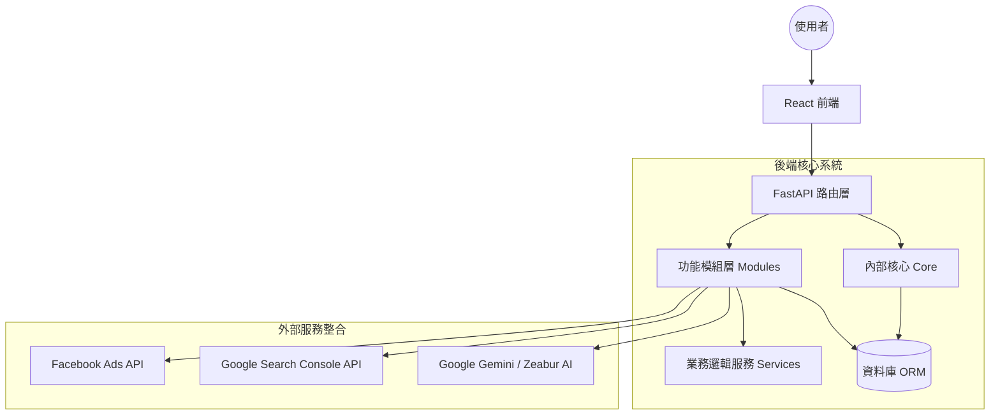

# 02_系統架構 (System Architecture)

## 🏗️ 整體架構設計
**站略 (Site-tegy)** 採用現代化的層級式與模組化架構，旨在達成「高內聚、低耦合」的目標。後端基於 FastAPI 的非同步性能，前端則利用 React 的組件化優勢。

### 架構層級圖


---

## 📂 後端架構：模組化設計 (v2.0.0)
系統將通用邏輯與特定功能分離，確保代碼的可測試性與複用性。

### 1. 核心共用 (core/)
`core/` 資料夾包含了系統運行的基石，不涉及具體業務邏輯：
- **config.py**：環境變數驗證與集中管理。
- **security.py**：Fernet 加密工具與認證底層邏輯。
- **exceptions.py**：統一的例外處理機制與錯誤代碼。
- **startup.py**：啟動任務（資料庫連接檢查、遷移自動執行、預設權限初始化）。

### 2. 功能模組 (modules/)
每個模組都是一個自包含的單元，通常包含以下結構：
- `router.py`：定義 API 端點。
- `service.py`：處理外部 API 交互與複雜計算。
- `dependencies.py`：模組特定的依賴注入（如模組級權限檢查）。
- `README.md`：模組的開發與調用說明。

**目前版本已模組化的功能：** `auth` (認證), `ai_hub` (AI服務), `gsc` (Search Console)。

---

## 🎨 前端架構：組件化與保護
前端採用 React 19 並搭配 Vite 構建，強調響應式體驗與路由安全。

### 關鍵設計模式
- **組件分離**：`components/` 存放通用 UI（Layout, Sidebar, Charts），`pages/` 存放頁面邏輯。
- **服務層管理**：`services/` 集中處理 API 呼叫，確保前端不與 API 路徑直接耦合。
- **模組保護機制 (ProtectedModule)**：
  透過自訂 Hook 或高階組件，根據後端提供的「模組權限清單」動態隱藏導覽列或阻斷未授權的路由存取。

---

## 🔐 數據流與安全性
1. **認證流程**：
   - 採用 Google OAuth 2.0 取得 ID Token。
   - 後端驗證 Token 後分發 JWT 或 維持 Session。
2. **敏感資料加密**：
   - 第三方 API Tokens (Facebook, GSC) 在寫入資料庫前，皆使用 **Fernet** 進行對稱加密。
3. **權限檢查路徑**：
   ```mermaid
   sequenceDiagram
       User->>API: 請求數據 (帶 Authorization Header)
       API-->>Auth_Module: 驗證使用者身份 (get_current_user)
       Auth_Module-->>Permission_Check: 檢查模組權限 (require_module)
       Permission_Check-->>API: 授權通過
       API->>Module_Service: 執行業務邏輯
       Module_Service->>User: 回傳結果
   ```

---

## 📈 效能優化策略
- **非同步 I/O**：使用 Python `async/await` 處理所有外部 API 調用。
- **批次請求 (Batching)**：Facebook Ads 數據採用批次請求減少網絡往返。
- **快取機制 (Caching)**：針對如 GSC 頁面標題等靜態資訊實作資料庫快取。

---

**站略 (Site-tegy) 技術架構小組**  
*穩定的底層，支撐多變的戰略。*
