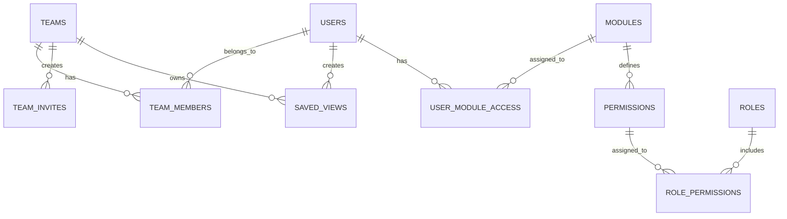

# 03_資料庫設計 (Database Design)

## 🗄️ 核心設計理念
**站略 (Site-tegy)** 的資料庫架構設計以「多租戶隔離」與「擴充性」為核心。系統支援 SQLite (開發環境) 與 PostgreSQL (生產環境) 的無縫切換，並透過 Alembic 進行版本遷移管理。

### 系統實體關係圖 (ERD)

---

## 🔑 資料表詳細規格

### 1. 核心業務表 (Core Business)
| 資料表 | 說明 | 關鍵欄位 |
| :--- | :--- | :--- |
| **users** | 儲存使用者身份與全域設定。 | `google_id`, `email`, `is_super_admin`, `ai_provider` |
| **teams** | 儲存團隊隔離環境與團隊級 Token。 | `owner_id`, `fb_access_token` (Encrypted) |
| **team_members** | 使用者與團隊的關聯橋接表。 | `user_id`, `team_id`, `role` (Admin/Member/Viewer) |
| **team_invites** | 管理團隊加入邀請碼。 | `code`, `expires_at`, `used_count` |

### 2. 數據整合與快取表 (Integration & Cache)
| 資料表 | 說明 | 關鍵欄位 |
| :--- | :--- | :--- |
| **saved_views** | 儲存使用者的常用指標篩選組合。 | `metrics` (JSON), `user_id`, `team_id` |
| **page_titles** | 快取 GSC URL 的標題，減少 HTTP 請求。 | `url`, `title`, `fetched_at` |

### 3. 權限管理系統表 (Permission 2.0)
| 資料表 | 說明 | 關鍵欄位 |
| :--- | :--- | :--- |
| **modules** | 定義系統功能模組。 | `key` (fb_ads, gsc, ga4), `enabled` |
| **permissions** | 定義具體的功能動作。 | `key` (module:feature:action), `module_id` |
| **roles** | 定義權限角色。 | `key` (team_owner), `scope` (system, team) |
| **user_permissions** | 細粒度授權或撤銷特定權限。 | `user_id`, `permission_id`, `granted` (Boolean) |

---

## 🛡️ 資料安全性與加密
為了符合合規性，**站略 (Site-tegy)** 對敏感欄位進行 **Fernet (AES-128)** 對稱加密。

**受加密保護的欄位包括：**
- `users.fb_access_token`, `users.fb_app_secret`
- `users.zeabur_api_key`, `users.gemini_api_key`
- `teams.fb_access_token`

---

## 🛠️ 資料庫遷移與維護
1. **環境切換**：系統會自動檢測 `DATABASE_URL`。若為空則預設啟動 `backend/facebook_dashboard.db` (SQLite)。
2. **Alembic 流程**：
   - 建立遷移：`alembic revision --autogenerate -m "description"`
   - 執行遷移：`alembic upgrade head`
3. **擴充建議**：新增功能模組時，應先於 `modules` 與 `permissions` 插入對應記錄，再於代碼中使用 `require_module` 依賴項。

---

**站略 (Site-tegy) 資料庫架構組**  
*結構的嚴謹，決定戰略的深度。*
