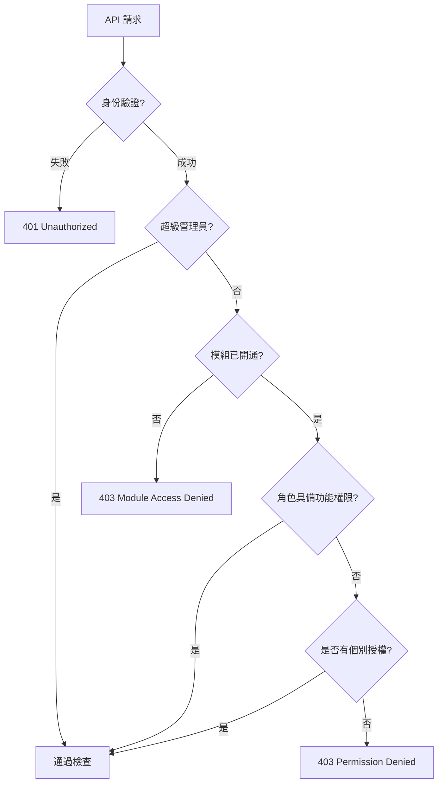

# 04_權限管理系統 (Permission & Access Control)

## 🛡️ 權限設計藍圖
**站略 (Site-tegy)** 採用了 **RBAC (角色存取控制)** 與 **模組化授權** 雙層機制。這套系統確保了數據在團隊間的嚴格隔離，同時為未來的訂閱方案 (SaaS) 提供韌性支撐。

### 權限檢查流程圖


---

## 👥 角色與權限定義 (RBAC)
系統將權限細分為 `模組:功能:動作`（例如 `fb_ads:analytics:view`），並透過角色進行聚合。

### 角色權限矩陣 (預設配置)
| 角色 | 說明 | FB Ads | GSC / GA4 | AI Hub |
| :--- | :--- | :---: | :---: | :---: |
| **Owner** | 團隊擁有者，擁有最高控制權。 | 管理 | 管理 | 全權使用 |
| **Admin** | 管理員，可管理成員與數據配置。 | 管理 | 管理 | 全權使用 |
| **Member** | 一般成員，可查看與操作數據。 | 查看 | 查看 | 使用 |
| **Viewer** | 檢視者，僅具備唯讀權限。 | 唯讀 | 唯讀 | 禁用 |

---

## 🧩 模組化授權 (Module Access)
除了角色權限，系統還具備「模組級開關」。這是控制訂閱方案與功能解鎖的關鍵：

1. **系統開關**：超級管理員可在後端統一停用某個實驗性模組。
2. **工作區開關**：根據團隊的訂閱等級（Free / Starter / Pro），系統會動態過濾可用的功能模組。
3. **實作方式**：後端路由透過 `require_module("gsc")` 裝飾器進行攔截。

---

## 🚀 訂閱與擴充策略 (未來規畫)
目前資料庫已預留訂閱方案的結構，未來將支援以下邏輯：
- **Free 方案**：僅限個人工作區使用核心 FB Ads 功能。
- **Pro 方案**：解鎖團隊功能、AI 智慧分析師與跨平台數據對比。
- **擴充性**：新增功能時，只需在 `permissions` 表新增記錄，並將其關聯至對應角色即可完成開通。

---

## 🛠️ 開發者指引：如何檢查權限？
在 FastAPI 路由中，只需一行依賴注入即可完成保護：

```python
@router.get("/analytics")
def get_analytics(
    current_user: User = Depends(get_current_user),
    _: bool = Depends(require_module("fb_ads"))
):
    # 執行業務邏輯...
```

---

**站略 (Site-tegy) 安全與權限組**  
*精準的授權，讓權力在戰略中更有序。*
