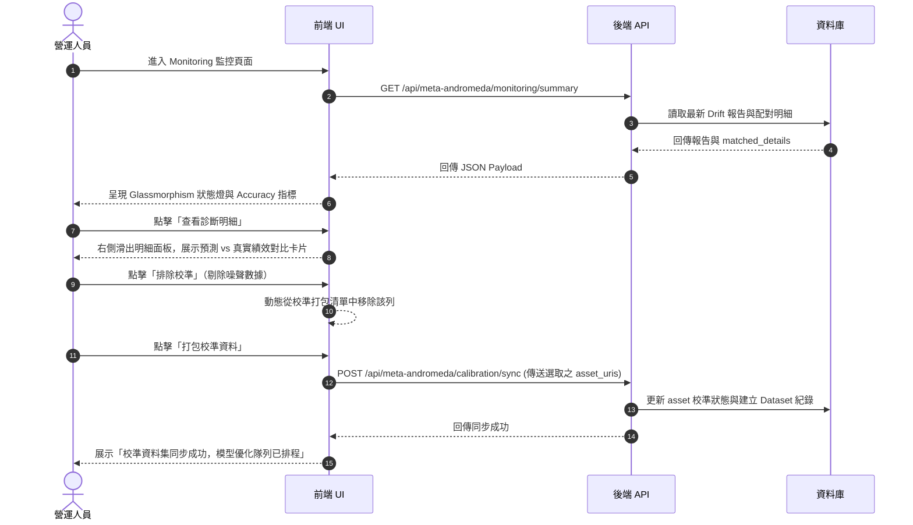

# 18 Meta Andromeda Phase 3 學習閉環與診斷校準工作台規劃

## 目的

本文件基於 [17_Meta_Andromeda_Phase6_預測與真實績效匹配與漂移診斷設計方案.md](file:///C:/Users/BWM2/Documents/python/DataVue-App/docs/17_Meta_Andromeda_Phase6_%E9%A0%90%E6%B8%AC%E8%88%87%E7%9C%9F%E5%AF%A6%E7%B8%BE%E6%95%88%E5%8C%B9%E9%85%8D%E8%88%87%E6%BC%82%E7%A7%BB%E8%A8%BA%E6%96%B7%E8%A8%AD%E8%A8%88%E6%96%B9%E6%A1%88.md) 的底層匹配算法與指標，規劃 `Meta Andromeda Phase 3: Learning Loop (學習閉環)` 在前端 UI 上的操作工作台與呈現設計。

我們的目標是將後端計算出的真實偏差（MAE）與模型準確度（Accuracy）轉化為直覺、極富現代感且易於營運操作的「漂移診斷面板」與「資料校準工作流」。

---

## 前端功能模組與 UI 呈現設計

### 1. 漂移監控面板 (Drift Monitoring Panel)
* **位置**：`/meta-andromeda/monitoring` (監控總覽頁面)
* **視覺設計**：
  * 使用 **Glassmorphism (磨砂玻璃)** 漸變卡片呈現最新的 Drift 報告狀態。
  * **動態狀態呼吸燈**：
    * `healthy`：顯示綠色穩定微光，標記「healthy | 模型健康」。
    * `warning`：黃色慢速閃爍，標記「warning | 輕微偏差」。
    * `drifted`：紅色快速脈衝呼吸燈（CSS Pulse Animation），標記「drifted | 嚴重漂移」。
  * 核心 KPI 卡片展示：
    * **預測準確率 (Accuracy)**：以漸變環形進度條（Circular Progress）展示，如 `40.0%`。
    * **平均絕對偏差 (MAE)**：以計量儀表（Gauge Bar）展示，如 `0.80`（超過 0.50 為紅色警示區）。
    * **匹配對數 (Matched Pairs)**：展示「已成功匹配 $N$ 筆廣告」。

---

### 2. 漂移診斷明細面板 (Drift Diagnostics Panel)
* **互動方式**：在監控卡片點擊 **「查看診斷明細 (View Diagnostic Details)」** 按鈕後，右側滑出 (Slide-over) 漸變玻璃面板（高階毛玻璃濾鏡 `backdrop-filter: blur(20px)`）。
* **明細呈現**：
  * 系統將後端 `matched_details` 的列表以對照卡片呈現。
  * 每列廣告展示：
    * **廣告基本資訊**：縮圖、廣告名稱、`ad_id`。
    * **預期 vs 實際對比區**：
      * 左側：`預測 ROAS 區間` (如高回報 High，紫色漸變標籤)。
      * 中間：雙向漸變箭頭（若匹配失敗，箭頭顯示為紅色裂痕圖示）。
      * 右側：`實際投產表現` (如低回報 Low，紅色漸變標籤，並標註真實 ROAS: 0.5)。
    * **級距偏差 (Deviation)**：以文字與色區指示，如「偏差值: +2 (偏高預估)」。
  * **單列操作按鈕**：
    * **「排除校準 (Exclude from Dataset)」**：若某筆廣告表現異常是因為預算限制、人為手動暫停等非模型特徵因素，營運人員可一鍵排除，以防干擾校準資料品質。

---

### 3. 資料校準工作流 (Calibration Workflow)
* **用途**：將預測失準的真實投放資料，轉化為強化模型預估精準度的微調訓練集。
* **頂部全域操作按鈕**：
  * **「打包校準資料 (Package & Sync Dataset)」**：
    * 點擊後，系統將當前窗口下所有「未被排除且有偏差 (Error > 0)」的廣告對象（含 `asset_uri`、原始預估特徵、真實 ROAS label）一鍵打包。
    * 顯示二次確認 Modal，點擊「確定同步」後，發送 `POST /api/meta-andromeda/calibration/sync` 至後端，並於介面展示「校準資料集已建立，共 $M$ 筆素材」。

---

### 4. 模型發佈安全鎖 (Release Gate Lock)
* **位置**：`/meta-andromeda/release` (發佈管理頁面)
* **視覺呈現**：
  * 新增一個 **「線上實測對照證據 (Online Performance Evidence)」** 面板。
  * 讀取最新的漂移報告。若線上 Drift 狀態為 `drifted`，則原先的 **「核准候選模型發佈 (Approve Candidate)」** 按鈕將被置灰鎖定 (disabled)。
  * **警示鎖定提示**：於按鈕旁顯示紅色警告訊息：
    > ⚠️ 線上模型已檢測出顯著漂移 (Accuracy: 40% < 60%)。為了避免劣質預估，已自動鎖定發佈。請先進入監控工作台執行「資料校準」，再行核准新模型。

---

## 互動流程圖



---

## 預期後端 API 擴充規格 (第一階段後續)

為配合上述前端操作，後端在 Phase 3 將新增：

1. **`POST /api/meta-andromeda/calibration/sync`**
   * **功能**：打包所勾選的真實觀測廣告資料為校準數據集。
   * **Request Body**：
     ```json
     {
       "window_kind": "last_7d",
       "excluded_observed_ids": ["ma_obs_20260616_123456"]
     }
     ```
   * **Response**：
     ```json
     {
       "dataset_id": "cal_ds_20260616_001",
       "synced_count": 8,
       "status": "queued_for_calibration"
     }
     ```
