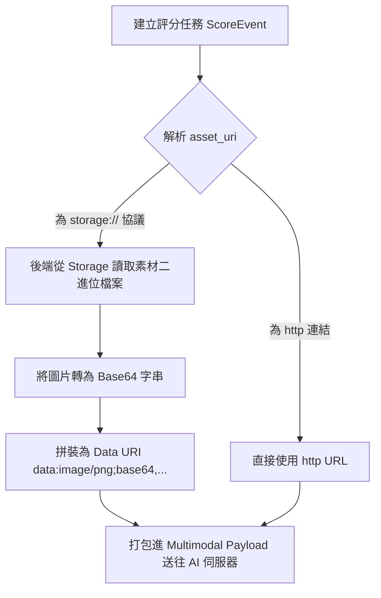

# 24 Meta Andromeda 多模態視覺素材優化方案

本文件針對 Meta Andromeda 模組目前在多模態（Multimodal）視覺評估中，因缺少公開 CDN 網域而導致 AI 「看不到圖片」的技術瓶頸，提出第一階段的視覺優化與實作方案。

---

## 🕳️ 當前技術瓶頸與問題背景

當前在 [runtime.py](file:///C:/Users/BWM2/Documents/python/DataVue-App/backend/modules/meta_andromeda/runtime.py#L58-L72) 中，`_build_multimodal_user_content` 函數負責建構發送給 AI 服務（如 OpenRouter）的 Payload：

```python
    if score_payload.get("asset_type") == "image" and isinstance(image_url, str):
        normalized_url = image_url.strip()
        if normalized_url.startswith(("http://", "https://")):
            user_content.append({"type": "image_url", "image_url": {"url": normalized_url}})
```

### 影響與瓶頸：
1. **圖片傳輸受阻**：在前後端分離部署（例如 Zeabur SaaS）或本地開發環境下，如果沒有配置或啟用公開 CDN（`META_ANDROMEDA_STORAGE_PUBLIC_BASE_URL` 為空），廣告素材在系統中是以內部協議 `storage://meta-andromeda/...` 進行標記的。
2. **AI 盲測評估**：由於 `storage://` 不是以 `http` 或 `https` 開頭，這些素材在 runtime 評估時，**根本不會被加入 AI 的 `image_url` Payload 中**。
3. **結果落差大**：AI 實際上「沒有看見圖片」，僅能根據標題與主要文字等純文字特徵進行模擬，這導致最終回傳的評分與摘要說明與圖片本身的實際視覺設計（色彩、佈局、OCR 文字等）存在巨大的落差，使多模態評估名存實亡。

---

## 🚀 優化方案：Base64 視覺編碼直接傳輸機制

為了在沒有 CDN 或外部無法直接訪問後端伺服器（例如私有 IP 或 Intranet）的情況下，依然能讓 AI 看見圖片，我們提出將圖片轉為 **Base64 Data URI** 直接嵌入 Prompt Payload 中的優化方案。

### 📊 架構調整示意圖



---

## 💻 程式碼修改計畫草案

### 1. 修改 [runtime.py](file:///C:/Users/BWM2/Documents/python/DataVue-App/backend/modules/meta_andromeda/runtime.py) 以支援 Base64 載入與傳遞

#### 變更位置 1: 擴充 `_build_multimodal_user_content` 允許 `data:image/` 格式

```diff
-        if normalized_url.startswith(("http://", "https://")):
+        if normalized_url.startswith(("http://", "https://", "data:image/")):
             user_content.append({"type": "image_url", "image_url": {"url": normalized_url}})
```

#### 變更位置 2: 在 `generate_score_result` 中將內部 `storage://` 素材編碼為 Base64

在 `generate_score_result` 讀取資料庫金鑰與素材的區塊中，若發現是 `storage://` 協議，則自動讀取檔案並轉為 Base64 Data URI，塞入 `request_context["asset_public_url"]`：

```python
# 在 backend/modules/meta_andromeda/runtime.py 的 generate_score_result 中新增以下邏輯：

                # 如果 asset_uri 是內部儲存協議，將其轉為 Base64 Data URI
                if asset and asset.asset_uri.startswith("storage://") and asset.asset_type == "image":
                    try:
                        from pathlib import Path
                        from core.config import settings
                        import base64
                        
                        if asset.storage_backend == "filesystem":
                            storage_root = Path(settings.META_ANDROMEDA_STORAGE_ROOT)
                            safe_path = (storage_root / asset.storage_key).resolve()
                            if str(safe_path).startswith(str(storage_root.resolve())) and safe_path.exists():
                                file_bytes = safe_path.read_bytes()
                                mime_type = "image/png"
                                if asset.source_filename.lower().endswith((".jpg", ".jpeg")):
                                    mime_type = "image/jpeg"
                                elif asset.source_filename.lower().endswith(".webp"):
                                    mime_type = "image/webp"
                                
                                base64_str = base64.b64encode(file_bytes).decode("utf-8")
                                # 設定為 data:image 格式，讓多模態構建器能直接發送
                                request_context["asset_public_url"] = f"data:{mime_type};base64,{base64_str}"
                        
                        elif asset.storage_backend == "s3_compatible":
                            from .storage import storage_adapter
                            client = storage_adapter._build_s3_client()
                            bucket = settings.META_ANDROMEDA_STORAGE_S3_BUCKET
                            response = client.get_object(Bucket=bucket, Key=asset.storage_key)
                            file_bytes = response['Body'].read()
                            
                            mime_type = response.get('ContentType', 'image/png')
                            base64_str = base64.b64encode(file_bytes).decode("utf-8")
                            request_context["asset_public_url"] = f"data:{mime_type};base64,{base64_str}"
                            
                    except Exception as e:
                        logger.error(f"[MetaAndromeda] Failed to encode asset to base64: {e}")
```

---

## 🎯 預期效益與驗證方法

1. **視覺理解真正落地**：AI 聚合模型在接收到廣告素材後，能對圖片中的**主視覺元素、OCR 文字密度、品牌 Logo 占比以及排版美感**進行實質分析，給出具備針對性的評分與具體改善摘要。
2. **無需配置 CDN**：徹底擺脫了 ephemeral 生產環境下本機檔案無法對外曝露的限制，保障本地測試與 Zeabur 部署環境的一致性。
3. **驗證方式**：
   - 使用「評分工作台」重新提交一張包含清晰文字與按鈕的廣告圖片。
   - 查看審核佇列的結果摘要中，AI 是否能明確提及圖中的具體文字內容（例如：「檢測到畫面中的 CTA 按鈕為...」），以證實圖片特徵已成功送達。
