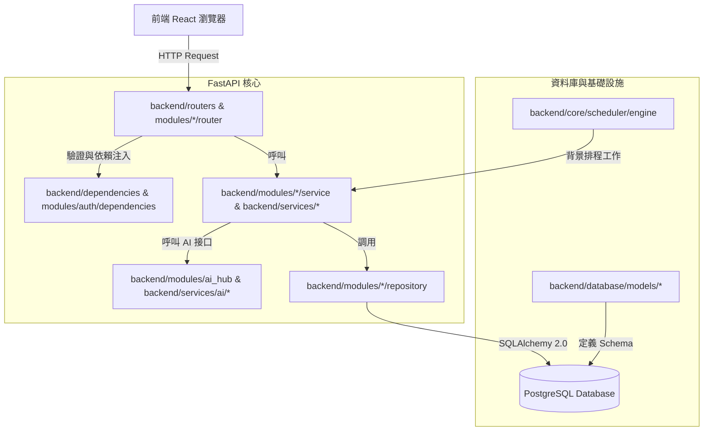
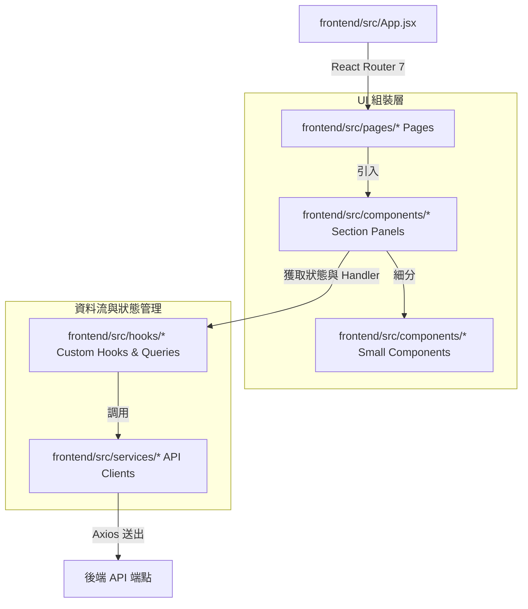

# DataVue 專案核心原始碼架構與關聯分析

本文件提供 DataVue 專案整理過的**核心原始碼架構、模組關聯與依賴分析**。旨在幫助開發者與 AI 代理快速掌握系統全貌，避免龐雜的逐檔清單干擾，聚焦於核心業務模組。

---

## 一、 技術棧與架構原則

DataVue 採用標準的前後端分離架構：

*   **後端 (FastAPI + SQLAlchemy 2.0)**
    *   **入口點**：[backend/main.py](file:///C:/Users/BWM2/Documents/python/DataVue-App/backend/main.py)（掛載路由與全域跨域配置，保持精簡）。
    *   **業務設計**：遵循 `Router (API 端點) ➔ Service (業務邏輯) ➔ Repository / Database Model (資料存取與實體)` 的層級設計。
    *   **資料庫遷移**：使用 Alembic 進行資料庫版本控制。
*   **前端 (React 19 + Vite 7 + Vanilla CSS)**
    *   **路由管理**：使用 React Router 7。除 Login 與 Layout 外，所有模組頁面皆使用 `lazy()` 進行延遲載入。
    *   **狀態管理與快取**：統一使用 `@tanstack/react-query` 進行 API 數據獲取與快取。
    *   **重構規範**：頁面組合層目標 `<300~400` 行，功能面板/組件 `<600` 行，狀態與 API 呼叫儘量抽離至專屬的 Custom Hooks 中。

---

## 二、 專案核心目錄結構

隱去設定檔與工具鏈目錄後，核心目錄結構如下：

```
DataVue-App/
├── backend/                    # 後端 FastAPI 專案
│   ├── alembic/                # 資料庫遷移檔
│   ├── core/                   # 跨模組基礎設施 (配置、安全、排程、例外)
│   │   └── scheduler/          # 統一背景排程工作 (cron)
│   ├── database/               # 資料庫連線配置與 SQLAlchemy Model
│   ├── modules/                # 業務功能模組 (以功能邊界高度模組化)
│   │   ├── ai_hub/             # AI 接口服務 (OpenRouter/Zeabur/Gemini)
│   │   ├── auth/               # 使用者認證與權限依賴
│   │   ├── contribution/       # MMM 廣告活動貢獻衡量模組
│   │   ├── fb_ads/             # Facebook Ads 數據讀取與 KPI 處理
│   │   ├── ga4/                # GA4 數據讀取與規則分析
│   │   └── meta_andromeda/     # 核心 AI 預測模型管理與評分管線
│   ├── routers/                # 既有相容層路由
│   ├── services/               # 既有相容層服務 (AI, integration, LINE, report)
│   └── tests/                  # 後端單元測試與整合測試
├── docs/                       # 專案實作規劃與技術手冊
├── frontend/                   # 前端 React 19 專案
│   └── src/
│       ├── components/         # 業務功能元件及面板 (依模組分類)
│       │   ├── Admin/          # 管理後台子元件
│       │   ├── Analytics/      # 數據分析子元件
│       │   ├── Contribution/   # 貢獻分析子元件
│       │   ├── GA4/            # GA4 報表子元件
│       │   ├── GSC/            # Search Console 報表子元件
│       │   ├── MetaAndromeda/  # Andromeda 模型相關子元件
│       │   └── Reports/        # 週報相關子元件
│       ├── constants/          # 全域常數與指標註冊表
│       ├── hooks/              # 封裝業務與 API 數據流的 Custom Hooks
│       ├── pages/              # 路由頁面 (高層組合元件)
│       └── services/           # 封裝 axios 請求的 API Clients
└── scripts/                    # 運維與自動化驗證腳本
```

---

## 三、 原始碼行數統計與模組佔比

依據 [source_stats.ps1](file:///C:/Users/BWM2/Documents/python/DataVue-App/scripts/validation/source_stats.ps1)（2026-07-17 統計結果），專案整體原始碼數據如下：

*   **總檔案數量**：**496** 個
*   **總程式碼行數**：**96,844** 行

### 模組佔比分佈

| 目錄區塊 | 檔案數量 | 程式碼行數 | 行數佔比 | 核心定位 |
| :--- | :---: | :---: | :---: | :--- |
| **後端 (backend)** | 261 | 52,843 | 54.6% | 業務 API、AI 預測評分管線、資料存取與遷移控制 |
| **前端 (frontend)** | 230 | 43,228 | 44.6% | 響應式 Glassmorphism UI、自定義 Hooks 與資料呈現 |
| **根目錄與指令腳本** | 5 | 773 | 0.8% | 開發與維運驗證自動化腳本 |
| **總計** | **496** | **96,844** | **100%** | |

---

## 四、 核心業務模組關聯

### 1. 後端架構關聯圖 (Mermaid)



### 2. 前端架構關聯圖 (Mermaid)



### 3. 核心業務數據鏈

*   **Meta Andromeda (AI 預測與評分模組)**：
    `Facebook Ads 數據導入` ➔ `自動特徵工程` ➔ `模型評分管線 (calibration_pipeline)` ➔ `Review Queue (審查隊列)` ➔ `專家標註` ➔ `自適應校準更新 (prompt_profiles)`。
*   **GA4 轉換與即時洞察**：
    `GA4 API 獲取資料` ➔ `分類規則匹配 (landing_pages/items)` ➔ `異常偵測 (anomaly)` ➔ `歸因渠道精準化 (channels)` ➔ `LINE Alert 異常推播` / `AI 摘要自動生成`。
*   **GSC 搜尋外觀分析**：
    `GSC API` ➔ `searchAppearance 維度分析` ➔ `全站總量 (dimensions=date) 分母計算` ➔ `關鍵字疑似 AI 相關 (SGE/AI Overview) 占比統計` ➔ `前端 SearchAppearanceTab 展示`。

---

## 五、 核心檔案職責與依賴對照表

精選專案中最重要的業務核心檔案，排除 Alembic 遷移檔與單元測試檔後的快速索引表：

### 1. 後端核心檔案

| 核心檔案路徑 | 行數 | 核心職責 | 關鍵內部依賴 |
| :--- | :---: | :--- | :--- |
| `backend/main.py` | 424 | 後端 API 啟動點，掛載所有路由與 CORS 機制 | `routers/*`, `database` |
| `backend/routers/gsc.py` | 639 | 提供 GSC 數據接口，包含新增的搜尋外觀總覽端點 | `database`, `gsc_service` |
| `backend/modules/ga4/insights_router.py` | 574 | 提供 GA4 到達頁、商品分類、KPI 報表與 AI 摘要路由 | `database`, `ga4/insights` 套件 |
| `backend/modules/ga4/insights/_shared.py` | 249 | 提供 GA4 報表公共計算、比較期、渠道轉換規則分析 | `database`, `ga4_service` |
| `backend/modules/meta_andromeda/runtime.py` | 572 | Andromeda AI 預測引擎的核心運行時狀態機 | `model_registry`, `labeling` |
| `backend/modules/meta_andromeda/calibration_pipeline.py` | 600 | 負責模型評分指標比對、成對排序與偏差自適應校準管線 | `objective_routing`, `repository` |
| `backend/modules/contribution/service.py` | 760 | 貢獻分析模組 (MMM) 主要業務邏輯實現 | `database`, `contribution/engine` |
| `backend/modules/contribution/router.py` | 688 | 貢獻分析 API 接口，負責與前端對接 | `contribution/service` |
| `backend/services/facebook_service.py` | 579 | 處理 Facebook Ads 既有資料讀取與 legacy 兼容 | `fb_ads/actions_parsing` |
| `backend/modules/fb_ads/actions_parsing.py` | 275 | Facebook 廣告 KPI 計算、長條圖/成效資料轉換核心 | 無內部引用 |

### 2. 前端核心檔案

| 核心檔案路徑 | 行數 | 核心職責 | 關鍵內部依賴 |
| :--- | :---: | :--- | :--- |
| `frontend/src/pages/Analytics.jsx` | 946 | 主要分析大面板，組合趨勢、指標選擇與 Meta Andromeda 導入 | `components/TrendSection`, `hooks/useAnalyticsData` |
| `frontend/src/pages/GA4Insights.jsx` | 756 | GA4 洞察面板，承載分頁、異常警報與 AI 歸因分析展示 | `services/ga4InsightsService` |
| `frontend/src/components/GA4Stats.jsx` | 302 | GA4 報表組合層，串接設定面板、報表內容面板與自定義 Hook | `hooks/useGa4StatsData`, `components/GA4/*` |
| `frontend/src/components/GSCStats.jsx` | 232 | GSC 報表組合層，調用分頁、設定與表格處理 Hooks | `hooks/useGscAnalytics`, `components/GSC/*` |
| `frontend/src/components/GSC/RegularDataTab.jsx` | 1027 | GSC 傳統數據表格（每日、查詢、網頁），處理行展開與漸進加載 | 無內部引用 |
| `frontend/src/components/MetaAndromeda/release/ReleaseOverviewContent.jsx` | 720 | Andromeda 版本發布主內容面板，包含回測比較與候選版本 UI | `components/MetaAndromeda/release/releaseShared` |
| `frontend/src/hooks/useGa4StatsData.js` | 533 | 處理 GA4 屬性選擇、日期區間 preset 與比較期切換狀態 | `components/GA4/constants` |
| `frontend/src/hooks/useGscAnalytics.js` | 407 | 管理 GSC 站點、時間 preset 查詢與比較期 fetch 狀態機 | `components/GSC/constants` |
| `frontend/src/hooks/useSavedMetricViews.js` | 243 | 指標管理器專屬 Hook，包含對照 API 的視圖 CRUD 與 localStorage 遷移 | 無內部引用 |

---

## 六、 大型檔案瘦身重構現況

DataVue 前端與後端皆實行嚴格的程式碼規模控制，目前關鍵超標大檔重構現況如下：

*   **GA4Stats.jsx 重構**：
    原先 3184 行的大元件被徹底拆分為 [GA4Stats.jsx](file:///C:/Users/BWM2/Documents/python/DataVue-App/frontend/src/components/GA4Stats.jsx) 組合層（**302 行**）以及 `GA4SettingsPanel`、`GA4ContentPanel` 與 `useGa4StatsData` 等 Hooks，已達標。
*   **GSCStats.jsx 重構**：
    原先 3717 行的大元件被徹底拆分為 [GSCStats.jsx](file:///C:/Users/BWM2/Documents/python/DataVue-App/frontend/src/components/GSCStats.jsx) 組合層（**232 行**）以及 `GSCSettingsPanel`、`useGscAnalytics` 等 Hooks，已達標。
*   **MetaAndromedaRelease.jsx 重構**：
    由 1248 行瘦身至 **45 行**，狀態與 handler 移至 `useMetaAndromedaRelease`，主渲染由 `ReleaseOverviewContent` 承接，已達標。
*   **MetaAndromedaReviewQueue.jsx 重構**：
    由 788 行瘦身至 **119 行**，拆出 `useReviewQueue` 與 `ReviewQueueList`/`Detail` 元件，已達標。
*   **MetaAndromedaScoreLab.jsx 重構**：
    由 725 行瘦身至 **53 行**，拆出 `useScoreLab` 與表單、結果、歷史三個區塊元件，已達標。
*   **AdminDashboard.jsx 重構**：
    由 764 行瘦身至 **126 行**，資料載入與動作移至 `useAdminData`，區塊拆為 `AdminUsersSection` 與 `AdminTeamsSection`，已達標。
*   **MetricsManager.jsx 重構**：
    由 775 行瘦身至 **231 行**，樣式 `MetricsManager.css` 被拆分為 4 個 css 子模組，已達標。
*   **ReportConfig.jsx 重構**：
    由 692 行瘦身至 **205 行**，編輯/新增的 4 個步驟拆分成 `config/Step*` 元件，已達標。
