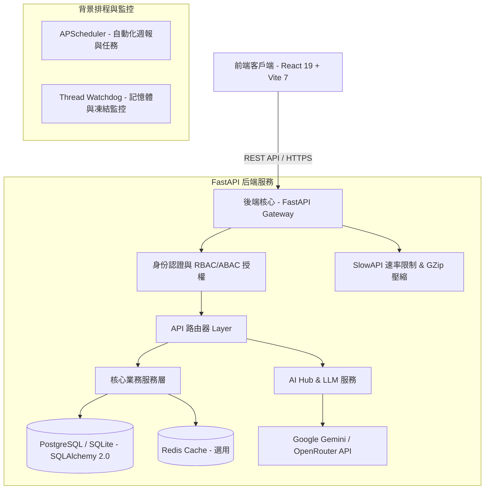

# DataVue 系統功能與架構詳細說明手冊

本手冊提供 DataVue 專案的全方位系統架構、核心商業功能模組、後台管理機制與技術實作細節，供開發者、系統管理員與維運人員參考。

---

## 1. 系統簡介與核心願景 (Executive Summary)

**DataVue** 是一款專為數位行銷團隊與數據分析師打造的全方位數據分析與 AI 輔助決策平台。系統整合了 Meta (Facebook) Ads、Google Search Console (GSC)、Google Analytics 4 (GA4) 等多平台數據，並結合大語言模型 (LLM) 進行 AI 廣告素材診斷、搜尋關鍵字內容缺口分析與 Marketing Mix Modeling (MMM) 廣告活動貢獻衡量。

### 🌟 系統核心亮點
1. **跨平台數據整合儀表板**：一站式監控 Facebook 廣告、GSC 搜尋流量與 GA4 網站轉換數據。
2. **AI 輔助智慧診斷引擎**：
   - **Meta Andromeda**：對廣告素材進行視覺與文本多維度診斷評分與疲勞預警。
   - **GSC AI 內容缺口建議 (Content Gap Suggester)**：自動分析長尾潛力關鍵字並提供 AI 文章寫作方向。
3. **Marketing Mix Modeling (MMM)**：衡量跨管道行銷活動的邊際貢獻比率與 ROI。
4. **細粒度權限與多租戶管理 (RBAC + ABAC)**：支援多團隊（Teams）隔離與模組級（Module-based）存取控管。
5. **企業級安全性與緊急維護機制**：第三方存取權限 Token 使用 Fernet 對稱加密儲存，並配備自動進程監控 (Watchdog) 與緊急權限修復控制台。

---

## 2. 系統總體技術架構 (System Architecture)

系統採用前後端分離架構，遵循高內聚、低偶合的設計原則。



### 🖥️ 前端技術棧 (Frontend Stack)
- **核心框架**：React 19 + Vite 7 + React Router 7
- **數據檢索與快取**：`@tanstack/react-query`
- **設計風格**：Modern Glassmorphism (磨砂玻璃) 現代 UI 設計，結合 Vanilla CSS
- **第三方整合**：`@react-oauth/google` (Google OAuth 2.0 快捷登入)
- **效能優化**：
  - 路由級延遲載入 (React.lazy + Suspense)
  - Client 端 JWT Token 自動過期監控與無感刷新機制

### ⚙️ 後端技術棧 (Backend Stack)
- **核心框架**：FastAPI (Python 3.10+)
- **資料庫與 ORM**：SQLAlchemy 2.0 (全非同步/同步混合模型支援)、Alembic 遷移工具
- **安全與加密**：
  - JWT (JSON Web Tokens) 雙重 Token 認證
  - Passlib (Bcrypt) 密碼雜湊
  - Cryptography (Fernet) 對稱加密（用於保護用戶連線的金鑰與 Access Token）
- **資安與效能**：
  - `SlowAPI`：防止 API 惡意刷請求（Rate Limiting）
  - `GZipMiddleware`：針對大型 JSON 回應進行即時壓縮
  - `Watchdog`：每分鐘監控主進程記憶體 (RSS) 與 Thread 堆疊狀態，防止 Event Loop 鎖死

---

## 3. 核心功能模組說明 (Core Business Modules)

### 3.1 Facebook Ads (Meta 廣告數據與動態指標引擎)
* **路由與頁面**：`/dashboard`, `/analytics`, `/metrics`
* **功能說明**：
  - **總覽儀表板**：提供廣告花費 (Spend)、曝光數 (Impressions)、點擊數 (Clicks)、點擊率 (CTR)、單次點擊成本 (CPC)、ROAS 等核心 KPI 即時統計。
  - **指標管理員 (Metrics Manager)**：允許使用者與團隊自訂衍生指標公式（例如：`Spend / Purchases` 或自訂權重計算），並支援動態公式解析引擎。
  - **數據趨勢與圖表**：支援多區間對比、多指標折線圖與圓餅圖分析。

### 3.2 Google Search Console (GSC 搜尋流量與 SEO AI 診斷)
* **路由與頁面**：`/gsc`
* **功能說明**：
  - **關鍵字與頁面成效**：分析搜尋點擊數、曝光數、平均 CTR 與平均排名。
  - **多維度交叉分析**：支援搜尋類型 (Web, Image, Video, News)、裝置 (Desktop, Mobile, Tablet) 及國家/地區之交叉數據切片。
  - **AI Overview (生成式 AI 搜尋) 數據**：追蹤 Google AI Overview 出現頻率與對網站流量之影響。
  - **AI 內容缺口建議 (Content Gap Suggester)**：自動挑選具有潛力但排名未達頂峰的關鍵字，透過 LLM 生成內容補強建議與具體的文章撰寫方向。

### 3.3 Google Analytics 4 (GA4 分析與即時轉換洞察)
* **路由與頁面**：`/ga4`, `/ga4-insights`
* **功能說明**：
  - **GA4 流量與事件**：檢視網站使用者數、新使用者數、會話數、事件發生數與目標轉換率。
  - **即時轉換洞察 (GA4 Insights)**：
    - 提供 **Source Grouping** 與 **Content Grouping** 自訂歸類彈性。
    - 追蹤不同管道在多個歸因時間軸下的轉換效益，精準標籤化流量來源。

### 3.4 Meta Andromeda (AI 廣告素材診斷與評分系統)
* **路由與頁面**：`/meta-andromeda` 及相關子路由 (`/review-queue`, `/monitoring`, `/release`, `/score-lab`)
* **功能說明**：
  - **多維度素材評分**：包含吸引力 (Hook)、轉換預測 (Conversion)、品牌合規 (Brand Compliance) 與廣告疲勞 (Fatigue) 4 大診斷維度。
  - **審查佇列 (Review Queue)**：自動鎖定待評分素材進行佇列化批次診斷。
  - **評分實驗室 (Score Lab)**：允許行銷人員輸入文案與圖片/影片連結進行即時模擬診斷與 Prompt 自適應校準。
  - **發布與監控 (Release & Monitoring)**：追蹤模型真實準確率與系統評分管道之健康狀態。

### 3.5 Marketing Mix Modeling (MMM 廣告活動貢獻衡量)
* **路由與頁面**：`/contribution`
* **功能說明**：
  - **跨管道貢獻評估**：整合 Facebook Ads 與 GA4 數據，解決單一渠道歸因偏誤問題。
  - **邊際貢獻與 ROI 分析**：計算各廣告活動的增量效益 (Incremental Lift)，並提供後續預算優化配置建議。

### 3.6 自動化週報與報告管理 (Automated Reports)
* **路由與頁面**：`/reports`, `/reports/new`, `/reports/:id`, `/reports/share/:token`
* **功能說明**：
  - **報告模組化編輯**：可自由組合多平台的 KPI 卡片、趨勢圖表與文字註解。
  - **排程自動生成**：支援每週/每月自動產出快照 (Snapshot) 報告。
  - **加密公開分享 (Shared Report)**：產生具備加密 Token 的公開連結，讓外部客戶或主管免登入即可瀏覽報告。

---

## 4. 後台管理與系統安全性 (Admin & Management Controls)

後台管理模組是 DataVue 的維運控制中心，主要由 `/admin` 路由及相關後端 Router (`routers/admin.py`, `routers/users.py`, `routers/permissions.py`) 組成。

```
後台管理架構
├── 使用者管理 (User Management)  --> 使用者列表 / 帳號狀態 / 角色變更 / 強制刪除
├── 團隊管理 (Team Management)     --> 團隊建立 / 成員邀請 / 多租戶隔離
├── 模組權限 (Module Access)      --> 系統模組開啟/關閉控管 (RBAC + ABAC)
└── 系統維護 (System Maintenance)  --> 健康檢查 / Redis & DB 狀態 / 緊急救援控制台
```

### 4.1 使用者管理與角色控制 (User & Role Management)
系統定義了三層級的角色權限：
1. **SUPER_ADMIN (最高管理者)**：
   - 擁有系統最高控制權，可存取 `/admin` 控制台。
   - 可檢視全系統所有使用者與團隊列表。
   - 可進行緊急權限修復與強制刪除帳號。
2. **ADMIN (團隊管理員)**：
   - 可管理特定團隊內的成員、發送邀請連結及設定團隊內部模組。
3. **USER (一般使用者)**：
   - 僅能存取經被授權的團隊與模組數據。

### 4.2 模組級權限控管 (Module Access Control)
後端透過 `UserModuleAccess` 表格達成 ABAC (Attribute-Based Access Control) 模組開關機制：
- 系統定義之核心模組 Key 包含：`fb_ads`, `gsc`, `ga4`, `meta_andromeda`, `contribution`。
- 最高管理者可針對特定使用者或團隊，單獨啟用或停用某個模組。
- 前端透過 `<ProtectedModule module="gsc">` 組件保護路由，若無權限則自動導向授權不足頁面或隱藏選單。

### 4.3 團隊與邀請機制 (Teams & Invites)
- **團隊創建與成員管理**：使用者可建立團隊，並成為該團隊的 Owner/Admin。
- **邀請碼機制 (`/invite/:code`)**：管理員可產生具時效性（如 7 天）的團隊邀請連結。受邀者點擊後登入即可自動加入對應團隊。

### 4.4 金鑰加密與第三方整合 (Token Security)
- **個人 API Key**：使用者可於個人設定中填入專屬的 Google Gemini 或 OpenRouter API Key。
- **Fernet 對稱加密**：資料庫寫入時統一使用系統 `ENCRYPTION_KEY` 進行 Fernet 加密，防止資料庫洩漏導致第三方 Token 曝光。

### 4.5 系統健康度監控與緊急救援機制 (System Health & Emergency Protocol)

#### 1. 健康檢查端點 (`/health` & `/health/detail`)
- **公開端點 `/health`**：供 Zeabur, Docker, Load Balancer 進行存活與就緒探針檢查（不暴露任何金鑰資訊）。
- **授權端點 `/health/detail`**：限 `SUPER_ADMIN` 存取，顯示詳細的 AI 供應商 API Key 狀態與資料庫連線統計。

#### 2. 緊急救援控制台 (`/api/emergency/*`)
當系統管理員因權限設定錯誤鎖死自身帳號時，可透過 `X-Emergency-Key` 標頭呼叫緊急端點：
- **`POST /api/emergency/fix-super-admin`**：自動將環境變數 `SUPER_ADMIN_EMAIL` 指定的帳號升級為最高管理者並補齊所有模組權限。
- **`GET /api/emergency/diagnose`**：匯出當前全系統所有使用者與模組權限映射圖，用於快速排查權限異常。

---

## 5. 資料庫模型架構總覽 (Database Schema)

資料庫採用 SQLAlchemy 2.0 ORM，主要模型分類如下：

| 模型類別 | 模型名稱 (Model) | 說明與用途 |
| :--- | :--- | :--- |
| **用戶與安全** | `User` | 儲存用戶基本資料、密碼 Hash、角色 (`is_super_admin`, `role`) 及加密金鑰 |
| | `UserIntegration` | 儲存第三方 OAuth Tokens (FB Ads, GA4, GSC Access Tokens) |
| **團隊與多租戶**| `Team` | 團隊基本資訊與擁有者關係 |
| | `TeamMember` | 團隊與使用者的多對多關聯及團隊內角色 (`OWNER`, `ADMIN`, `MEMBER`) |
| | `TeamInvite` | 團隊邀請碼、過期時間與使用狀態 |
| **權限控制** | `Module` | 系統模組清單 (`fb_ads`, `gsc`, `ga4`, `meta_andromeda`, `contribution`) |
| | `UserModuleAccess` | 使用者/團隊與模組的授權開關關聯表 |
| **商業與報表** | `SavedView` | 使用者儲存的篩選條件與儀表板視圖配置 |
| | `ScheduledReport` | 自動化報表產出排程與發送設定 |
| | `ReportSnapshot` | 歷史生成的週報與月報快照 |
| **Meta Andromeda**| `AndromedaEvaluation` | 廣告素材診斷評分紀錄與評分結果 |

---

## 6. 前後端目錄與主要檔案關聯 (Directory Map)

```
DataVue-App/
├── backend/                  # FastAPI 後端專案
│   ├── main.py               # 應用程式入口（包含 Middleware、Exception Handler 及 Health 端點）
│   ├── core/                 # 系統核心（startup.py 啟動任務、watchdog.py 監控、scheduler.py 排程）
│   ├── database/             # 資料庫模型 (models/) 與 Alembic 遷移腳本
│   ├── routers/              # 業務路由 (admin.py, gsc.py, ga4.py, facebook.py, ai.py, permissions.py 等)
│   ├── services/             # 業務邏輯服務層 (GSC, GA4, FB Ads, AI 診斷邏輯)
│   └── modules/              # 獨立高內聚模組 (meta_andromeda, contribution, ga4/insights)
├── frontend/                 # React 前端專案
│   ├── src/
│   │   ├── App.jsx           # 主路由入口（包含 ProtectedRoute 與 Lazy Loading 頁面載入）
│   │   ├── pages/            # 頁面組件 (AdminDashboard.jsx, SearchConsole.jsx, Analytics.jsx 等)
│   │   ├── components/       # 通用組件 (Sidebar.jsx, PermissionManager.jsx, SettingsModal.jsx 等)
│   │   ├── services/         # API 請求溝通層
│   │   └── hooks/            # 自訂 React Hooks (Authentication, Module Access)
└── docs/                     # 專案架構與開發設計文件
```

---

## 7. 結論與擴充維護建議

1. **模組擴充規範**：新增功能模組時，應於 `Module` 資料庫中註冊新的 `key`，並在前端 `App.jsx` 以 `<ProtectedModule module="new_module">` 進行保護。
2. **安全性原則**：涉及第三方 Access Token 或 API Keys 時，務必使用 `services/crypto.py` 之加密工具進行處理。
3. **營運與維運**：生產環境部署應定期檢視 `/health/detail` 與背景 Watchdog 日誌，確保 Event Loop 與核心排程無阻塞現象。
