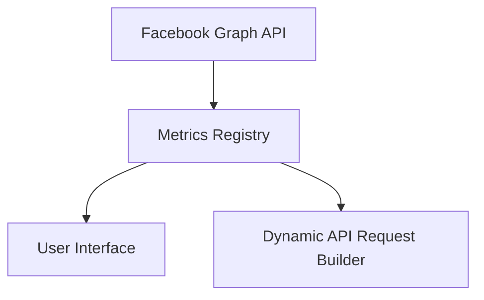

# System Architecture & Design Details

This document provides technical deep-dives into specific subsystems of the Facebook Dashboard SaaS.

---

## 🔐 Permission System (RBAC)

### Multi-Level Hierarchy
The system implements a dual-layer permission structure:
1.  **System Level**: Managed by Super Admin (Module access, global roles).
2.  **Team Level**: Internal team roles (Owner, Admin, Member, Viewer).

### Database Models
- `Module`: System-wide feature modules (e.g., `fb_ads`, `gsc`).
- `Permission`: Specific actions within modules.
- `Role`: Sets of permissions.
- `UserModuleAccess`: Junction table for granting modules to users.

---

## 📦 Metrics Registry (指標資料庫)

To handle 100+ Facebook Marketing API metrics, we use a registry-based approach.

### Architecture

### Registry Structure
Each metric is defined with:
- `key`: API field name.
- `label_zh/en`: Display names.
- `category`: Grouping (E-commerce, Funnel, etc.).
- `source`: Where to find it in the FB response (`actions`, `action_values`, or direct).

---

## 🤖 AI Analysis Engine

### Service Layer
`AIService` wraps the Google Gemini API. It performs:
1.  **Metric Diagnosis**: Finding outliers in ad performance.
2.  **Trend Interpretation**: Explaining why metrics changed between periods.
3.  **Recommendations**: Actionable advice for campaign optimization.

### Key Management
- **User Level**: Private keys for individual use.
- **Team Level**: Shared keys for team collaboration.
- **Priority**: Team Key > User Key > System Default.
