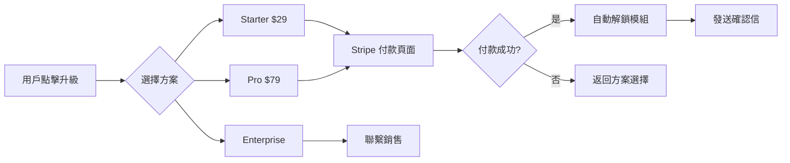

# 權限管理系統架構設計方案 (Permission & Access Control System)

**專案**: DataVue - 多模組數據儀表板平台  
**版本**: v2.0 (權限系統重構)  
**日期**: 2025-12-29  

---

## 背景與目標

### 現況
- ✅ Google OAuth 登入
- ✅ 超級管理員介面
- ✅ 個人工作區 vs 團隊工作區的基本劃分
- ✅ 現有模組：FB Ads、Google Search Console

### 挑戰
- ❌ 權限管理過於簡化，無法支援細緻的功能存取控制
- ❌ 隨著模組增加（GA4、未來擴展），缺乏彈性架構
- ❌ 團隊內無法針對不同模組分配不同權限

### 目標
設計一個**可擴展、細緻化、模組化**的權限管理系統，支援：
1. 多模組管理（FB Ads / GSC / GA4 / 未來模組）
2. 從大區域到小功能的層級權限控制
3. 個人工作區與團隊工作區的獨立權限管理
4. 角色與權限的靈活組合

---

## 架構設計

### 1. 權限架構層級

```
系統層級
├── 工作區層級 (Workspace Level)
│   ├── 個人工作區 (Personal Workspace)
│   └── 團隊工作區 (Team Workspace)
│       └── 團隊角色 (Team Roles)
│
└── 模組層級 (Module Level) ✨
    ├── FB Ads 模組
    │   ├── 帳號管理 (Account Management)
    │   ├── 數據查看 (Analytics View)
    │   ├── 報表生成 (Report Generation)
    │   ├── 視角管理 (View Management)
    │   └── AI 分析師 (AI Analyst)
    │
    ├── GSC 模組
    │   ├── 站點連接 (Site Connection)
    │   ├── 關鍵字分析 (Keyword Analysis)
    │   ├── 頁面分析 (Page Analysis)
    │   └── 趨勢報表 (Trend Reports)
    │
    └── GA4 模組 (未來)
        ├── 屬性連接 (Property Connection)
        ├── 事件追蹤 (Event Tracking)
        └── 轉換分析 (Conversion Analysis)
```

---

### 2. 核心概念定義

#### 2.1 角色 (Roles)

**系統級角色**：
| 角色 | 說明 | 適用範圍 |
|------|------|---------|
| **Super Admin** | 超級管理員，全系統最高權限 | 全系統 |
| **User** | 一般使用者 | 個人工作區 |

**團隊級角色**：
| 角色 | 說明 | 權限特性 |
|------|------|---------|
| **Owner** | 團隊擁有者 | 全團隊權限 + 解散團隊 |
| **Admin** | 團隊管理員 | 管理成員 + 配置模組權限 |
| **Member** | 一般成員 | 依照模組權限配置 |
| **Viewer** | 檢視者 | 唯讀權限 |

#### 2.2 權限 (Permissions)

**權限結構**：`模組:功能:動作`

範例：
- `fb_ads:analytics:view` - FB Ads 數據查看
- `fb_ads:account:manage` - FB Ads 帳號管理
- `gsc:keyword:view` - GSC 關鍵字查看
- `gsc:site:connect` - GSC 站點連接
- `ga4:property:connect` - GA4 屬性連接

**動作類型**：
- `view` - 查看
- `create` - 創建
- `edit` - 編輯
- `delete` - 刪除
- `manage` - 管理
- `connect` - 連接（API Token）

---

### 3. 訂閱方案與預設權限 ✨

#### 3.1 訂閱方案設計 (Subscription Tiers)

| 方案 | 月費 | FB Ads | GSC | GA4 | AI 分析師 | 團隊成員數 |
|------|------|:------:|:---:|:---:|:--------:|:----------:|
| **Free** | $0 | ✅ | ❌ | ❌ | ❌ | 個人 |
| **Starter** | $29 | ✅ | ✅ | ❌ | ❌ | 3 人 |
| **Pro** | $79 | ✅ | ✅ | ✅ | ✅ | 10 人 |
| **Enterprise** | 客製 | ✅ | ✅ | ✅ | ✅ | 無限 |

#### 3.2 新用戶預設權限

**註冊流程**：
1. 用戶透過 Google OAuth 登入
2. 系統自動創建帳號 → **預設為 Free 方案**
3. 自動授予個人工作區的 FB Ads 模組存取權

**預設配置**：
```python
# 新用戶註冊時自動執行
def setup_new_user(user_id: int):
    # 1. 設定訂閱方案
    create_subscription(user_id, plan='free')
    
    # 2. 授予個人工作區的 FB Ads 模組存取
    grant_module_access(
        user_id=user_id,
        team_id=None,  # 個人工作區
        module_key='fb_ads'
    )
    
    # 3. 授予基本權限
    grant_permissions(user_id, [
        'fb_ads:analytics:view',
        'fb_ads:report:generate',
        'fb_ads:view:create',
        'fb_ads:view:edit'
    ])
```

**Free 方案限制**：
- 僅個人工作區（無團隊功能）
- 僅 FB Ads 模組
- 無 AI 分析師
- 報表查看期限：最近 30 天

#### 3.3 付費升級機制

##### 升級流程



##### 自動開通權限

**Stripe Webhook 處理**：
```python
@router.post("/webhooks/stripe")
async def stripe_webhook(request: Request):
    event = stripe.Webhook.construct_event(
        payload=await request.body(),
        sig_header=request.headers.get('stripe-signature'),
        secret=STRIPE_WEBHOOK_SECRET
    )
    
    if event['type'] == 'checkout.session.completed':
        session = event['data']['object']
        user_id = session['client_reference_id']
        plan = session['metadata']['plan']  # 'starter' / 'pro'
        
        # 更新訂閱方案
        upgrade_subscription(user_id, plan)
        
        # 自動授予模組存取權
        if plan == 'starter':
            grant_module_access(user_id, None, 'gsc')
        elif plan == 'pro':
            grant_module_access(user_id, None, 'gsc')
            grant_module_access(user_id, None, 'ga4')
            enable_ai_analyst(user_id)
        
        # 發送通知
        send_upgrade_notification(user_id, plan)
    
    return {"status": "success"}
```

##### 手動開通（超級管理員）

**管理介面功能**：
```
/admin/users/{user_id}
├── 訂閱方案管理
│   ├── 當前方案：Free
│   ├── [升級至 Starter] 按鈕
│   ├── [升級至 Pro] 按鈕
│   └── 過期時間：無（免費方案）
│
└── 模組存取權管理
    ├── FB Ads [✅] 已啟用
    ├── GSC [❌] 未啟用 [開通] 按鈕
    └── GA4 [❌] 未啟用 [開通] 按鈕
```

#### 3.4 資料庫設計（訂閱相關）

##### `subscriptions` - 訂閱方案表
```sql
CREATE TABLE subscriptions (
    id SERIAL PRIMARY KEY,
    user_id INTEGER REFERENCES users(id) UNIQUE,
    plan VARCHAR(20) NOT NULL,  -- 'free', 'starter', 'pro', 'enterprise'
    status VARCHAR(20) DEFAULT 'active',  -- 'active', 'cancelled', 'expired'
    stripe_customer_id VARCHAR(100),
    stripe_subscription_id VARCHAR(100),
    current_period_start TIMESTAMP,
    current_period_end TIMESTAMP,
    created_at TIMESTAMP DEFAULT CURRENT_TIMESTAMP,
    updated_at TIMESTAMP DEFAULT CURRENT_TIMESTAMP
);
```

##### `subscription_history` - 訂閱歷史記錄
```sql
CREATE TABLE subscription_history (
    id SERIAL PRIMARY KEY,
    user_id INTEGER REFERENCES users(id),
    from_plan VARCHAR(20),
    to_plan VARCHAR(20),
    changed_by INTEGER REFERENCES users(id),  -- NULL = 自動升級
    reason VARCHAR(50),  -- 'upgrade', 'downgrade', 'admin_grant'
    changed_at TIMESTAMP DEFAULT CURRENT_TIMESTAMP
);
```

#### 3.5 前端訂閱管理 UI

**個人設定頁面 - 訂閱 Tab**：
```jsx
<SubscriptionSettings>
  <CurrentPlan>
    <h3>當前方案：Free</h3>
    <p>下次續費：-</p>
  </CurrentPlan>
  
  <UpgradeOptions>
    <PlanCard plan="starter">
      <h4>Starter - $29/月</h4>
      <ul>
        <li>✅ FB Ads 模組</li>
        <li>✅ GSC 模組</li>
        <li>✅ 團隊協作（3 人）</li>
      </ul>
      <button onClick={() => checkout('starter')}>升級</button>
    </PlanCard>
    
    <PlanCard plan="pro">
      <h4>Pro - $79/月</h4>
      <ul>
        <li>✅ FB Ads 模組</li>
        <li>✅ GSC 模組</li>
        <li>✅ GA4 模組</li>
        <li>✅ AI 分析師</li>
        <li>✅ 團隊協作（10 人）</li>
      </ul>
      <button onClick={() => checkout('pro')}>升級</button>
    </PlanCard>
  </UpgradeOptions>
</SubscriptionSettings>
```

#### 3.6 方案權限對照表

| 權限 | Free | Starter | Pro | Enterprise |
|------|:----:|:-------:|:---:|:----------:|
| **模組存取** |
| FB Ads | ✅ | ✅ | ✅ | ✅ |
| GSC | ❌ | ✅ | ✅ | ✅ |
| GA4 | ❌ | ❌ | ✅ | ✅ |
| **功能** |
| 數據查看 | ✅ | ✅ | ✅ | ✅ |
| 報表生成 | ✅ | ✅ | ✅ | ✅ |
| AI 分析師 | ❌ | ❌ | ✅ | ✅ |
| 視角管理 | ✅ | ✅ | ✅ | ✅ |
| **限制** |
| 歷史資料查看 | 30 天 | 90 天 | 1 年 | 無限 |
| 團隊數量 | 0 | 1 | 3 | 無限 |
| 團隊成員數 | - | 3 人 | 10 人 | 無限 |
| API 呼叫額度/月 | 1,000 | 10,000 | 100,000 | 客製 |

---

### 4. 資料庫設計

#### 3.1 新增資料表

##### `modules` - 模組定義表
```sql
CREATE TABLE modules (
    id SERIAL PRIMARY KEY,
    key VARCHAR(50) UNIQUE NOT NULL,  -- 'fb_ads', 'gsc', 'ga4'
    name VARCHAR(100) NOT NULL,        -- '廣告管理', '搜尋管理'
    description TEXT,
    icon VARCHAR(50),                  -- Emoji or icon class
    enabled BOOLEAN DEFAULT TRUE,
    created_at TIMESTAMP DEFAULT CURRENT_TIMESTAMP
);
```

##### `permissions` - 權限定義表
```sql
CREATE TABLE permissions (
    id SERIAL PRIMARY KEY,
    module_id INTEGER REFERENCES modules(id),
    key VARCHAR(100) UNIQUE NOT NULL,  -- 'fb_ads:analytics:view'
    name VARCHAR(100) NOT NULL,
    description TEXT,
    category VARCHAR(50),              -- 'feature', 'admin', 'api'
    created_at TIMESTAMP DEFAULT CURRENT_TIMESTAMP
);
```

##### `roles` - 角色定義表
```sql
CREATE TABLE roles (
    id SERIAL PRIMARY KEY,
    key VARCHAR(50) UNIQUE NOT NULL,   -- 'team_owner', 'team_admin'
    name VARCHAR(100) NOT NULL,
    description TEXT,
    scope VARCHAR(20) NOT NULL,        -- 'system', 'team', 'personal'
    created_at TIMESTAMP DEFAULT CURRENT_TIMESTAMP
);
```

##### `role_permissions` - 角色-權限關聯表
```sql
CREATE TABLE role_permissions (
    id SERIAL PRIMARY KEY,
    role_id INTEGER REFERENCES roles(id),
    permission_id INTEGER REFERENCES permissions(id),
    UNIQUE(role_id, permission_id)
);
```

##### `user_module_access` - 使用者-模組存取表 ✨
```sql
CREATE TABLE user_module_access (
    id SERIAL PRIMARY KEY,
    user_id INTEGER REFERENCES users(id),
    team_id INTEGER REFERENCES teams(id) NULL,  -- NULL = 個人工作區
    module_id INTEGER REFERENCES modules(id),
    enabled BOOLEAN DEFAULT TRUE,
    created_at TIMESTAMP DEFAULT CURRENT_TIMESTAMP,
    UNIQUE(user_id, team_id, module_id)
);
```

##### `user_permissions` - 使用者-權限關聯表（細緻化）
```sql
CREATE TABLE user_permissions (
    id SERIAL PRIMARY KEY,
    user_id INTEGER REFERENCES users(id),
    team_id INTEGER REFERENCES teams(id) NULL,
    permission_id INTEGER REFERENCES permissions(id),
    granted BOOLEAN DEFAULT TRUE,      -- TRUE=授予, FALSE=撤銷
    granted_at TIMESTAMP DEFAULT CURRENT_TIMESTAMP,
    granted_by INTEGER REFERENCES users(id),
    UNIQUE(user_id, team_id, permission_id)
);
```

#### 3.2 修改現有資料表

##### `teams` 表 - 新增模組配置欄位
```sql
ALTER TABLE teams ADD COLUMN enabled_modules JSONB DEFAULT '["fb_ads"]';
-- 範例: {"fb_ads": true, "gsc": true, "ga4": false}
```

---

### 4. 權限檢查邏輯

#### 4.1 權限驗證流程

```python
def check_permission(user_id: int, permission_key: str, team_id: int = None) -> bool:
    """
    檢查使用者是否有指定權限
    
    檢查順序：
    1. Super Admin → 永遠通過
    2. 個人工作區 (team_id=None)
       → 檢查 user_permissions 是否有授權
    3. 團隊工作區 (team_id)
       → 檢查團隊角色權限
       → 檢查個別授權/撤銷 (user_permissions)
    """
    # 1. Super Admin bypass
    if user.is_superadmin:
        return True
    
    # 2. 個人工作區
    if team_id is None:
        return has_personal_permission(user_id, permission_key)
    
    # 3. 團隊工作區
    # 3a. 檢查團隊角色預設權限
    team_role = get_user_team_role(user_id, team_id)
    role_permissions = get_role_permissions(team_role)
    
    if permission_key in role_permissions:
        # 3b. 檢查是否有明確撤銷
        if is_explicitly_revoked(user_id, team_id, permission_key):
            return False
        return True
    
    # 3c. 檢查是否有額外授權
    return is_explicitly_granted(user_id, team_id, permission_key)
```

#### 4.2 模組存取檢查

```python
def check_module_access(user_id: int, module_key: str, team_id: int = None) -> bool:
    """檢查使用者是否可存取指定模組"""
    # 1. 檢查模組是否啟用
    if not is_module_enabled(module_key):
        return False
    
    # 2. 個人工作區
    if team_id is None:
        return has_personal_module_access(user_id, module_key)
    
    # 3. 團隊工作區
    # 3a. 檢查團隊是否啟用該模組
    if not is_team_module_enabled(team_id, module_key):
        return False
    
    # 3b. 檢查使用者模組存取權
    return has_team_module_access(user_id, team_id, module_key)
```

---

### 5. API 端點設計

#### 5.1 權限管理 API (Admin Only)

```python
# 模組管理
GET    /api/admin/modules              # 列出所有模組
POST   /api/admin/modules              # 新增模組
PATCH  /api/admin/modules/{id}         # 更新模組
DELETE /api/admin/modules/{id}         # 刪除模組

# 權限管理
GET    /api/admin/permissions          # 列出所有權限
POST   /api/admin/permissions          # 新增權限
GET    /api/admin/permissions/module/{module_id}  # 指定模組的權限

# 角色管理
GET    /api/admin/roles                # 列出所有角色
POST   /api/admin/roles                # 新增角色
PATCH  /api/admin/roles/{id}           # 更新角色
POST   /api/admin/roles/{id}/permissions  # 配置角色權限
```

#### 5.2 團隊權限配置 API

```python
# 團隊模組啟用
GET    /api/teams/{team_id}/modules           # 列出團隊啟用的模組
POST   /api/teams/{team_id}/modules/enable   # 啟用模組
POST   /api/teams/{team_id}/modules/disable  # 停用模組

# 團隊成員權限
GET    /api/teams/{team_id}/members/{user_id}/permissions  # 查看成員權限
POST   /api/teams/{team_id}/members/{user_id}/permissions/grant   # 授予權限
POST   /api/teams/{team_id}/members/{user_id}/permissions/revoke  # 撤銷權限
```

#### 5.3 當前使用者權限查詢 API

```python
# 我的權限
GET    /api/me/permissions                    # 個人工作區權限
GET    /api/me/permissions/team/{team_id}     # 指定團隊權限
GET    /api/me/modules                        # 個人可用模組
GET    /api/me/modules/team/{team_id}         # 團隊可用模組
```

---

### 6. 前端實作

#### 6.1 權限檢查 Hook

```jsx
// hooks/usePermission.js
export const usePermission = (permissionKey, teamId = null) => {
  const [hasPermission, setHasPermission] = useState(false);
  const [loading, setLoading] = useState(true);
  
  useEffect(() => {
    checkUserPermission(permissionKey, teamId).then(result => {
      setHasPermission(result);
      setLoading(false);
    });
  }, [permissionKey, teamId]);
  
  return { hasPermission, loading };
};

// 使用範例
const { hasPermission } = usePermission('fb_ads:analytics:view', currentTeamId);

if (!hasPermission) {
  return <AccessDenied />;
}
```

#### 6.2 模組路由守衛

```jsx
// App.jsx
const ProtectedModuleRoute = ({ module, children }) => {
  const { hasAccess } = useModuleAccess(module);
  
  if (!hasAccess) {
    return <Navigate to="/access-denied" />;
  }
  
  return children;
};

// 使用範例
<Route path="/gsc" element={
  <ProtectedModuleRoute module="gsc">
    <SearchConsolePage />
  </ProtectedModuleRoute>
} />
```

#### 6.3 權限管理 UI

**團隊設定頁面新增「權限管理」Tab**：
- 模組啟用/停用開關
- 成員權限矩陣表格
- 角色快速指派

---

### 7. 預設權限配置

#### 7.1 FB Ads 模組權限

| 權限 Key | 名稱 | Admin | Member | Viewer |
|---------|------|:-----:|:------:|:------:|
| `fb_ads:analytics:view` | 數據查看 | ✅ | ✅ | ✅ |
| `fb_ads:account:manage` | 帳號管理 | ✅ | ❌ | ❌ |
| `fb_ads:report:generate` | 報表生成 | ✅ | ✅ | ✅ |
| `fb_ads:view:create` | 新增視角 | ✅ | ✅ | ❌ |
| `fb_ads:view:edit` | 編輯視角 | ✅ | ✅ | ❌ |
| `fb_ads:ai:use` | AI 分析師 | ✅ | ✅ | ❌ |

#### 7.2 GSC 模組權限

| 權限 Key | 名稱 | Admin | Member | Viewer |
|---------|------|:-----:|:------:|:------:|
| `gsc:site:connect` | 連接站點 | ✅ | ❌ | ❌ |
| `gsc:analytics:view` | 數據查看 | ✅ | ✅ | ✅ |
| `gsc:keyword:view` | 關鍵字分析 | ✅ | ✅ | ✅ |
| `gsc:page:view` | 頁面分析 | ✅ | ✅ | ✅ |
| `gsc:trend:view` | 趨勢分析 | ✅ | ✅ | ✅ |

---

### 8. 實作階段規劃

#### Phase 1: 資料庫與後端基礎 (2-3 天)
- [ ] 建立新資料表 (`modules`, `permissions`, `roles`, etc.)
- [ ] 實作權限檢查 Service (`PermissionService`)
- [ ] 建立模組管理 API
- [ ] 資料庫 Migration

#### Phase 2: 權限 API 與後端整合 (2-3 天)
- [ ] 團隊權限配置 API
- [ ] 使用者權限查詢 API
- [ ] 在現有 API 端點加入權限檢查 Decorator
- [ ] 單元測試

#### Phase 3: 前端權限檢查 (2 天)
- [ ] `usePermission` Hook
- [ ] `useModuleAccess` Hook
- [ ] 路由守衛
- [ ] UI 元件條件渲染

#### Phase 4: 管理介面 (2-3 天)
- [ ] 超級管理員：模組管理頁面
- [ ] 超級管理員：權限定義頁面
- [ ] 團隊管理員：成員權限配置頁面
- [ ] 權限矩陣表格元件

#### Phase 5: 測試與優化 (1-2 天)
- [ ] 整合測試
- [ ] 效能優化（權限快取）
- [ ] 文件撰寫

---

## 優勢與效益

### ✅ 可擴展性
- 新增模組只需加入 `modules` 表，無需修改核心邏輯
- 權限定義獨立於程式碼，可動態配置

### ✅ 細緻化控制
- 從模組層級到功能層級的完整權限控制
- 支援角色預設 + 個別授權/撤銷

### ✅ 使用者友善
- 團隊管理員可自行配置成員權限
- 清晰的權限矩陣 UI

### ✅ 安全性
- 後端強制權限驗證
- 前端僅做 UI 顯示控制

---

## 風險與考量

> [!WARNING]
> **資料庫遷移風險**
> - 現有團隊資料需要遷移到新權限系統
> - 建議先在測試環境驗證 Migration Script

> [!IMPORTANT]
> **向下相容性**
> - 現有 API 端點需逐步加入權限檢查
> - 可先以 Feature Flag 控制新權限系統啟用

> [!CAUTION]
> **效能考量**
> - 每個 API 請求都需檢查權限，需引入快取機制
> - 建議使用 Redis 快取使用者權限清單（TTL: 5-10分鐘）

---

## 參考資料

- [RBAC 最佳實踐](https://auth0.com/docs/manage-users/access-control/rbac)
- [FastAPI 權限檢查範例](https://fastapi.tiangolo.com/advanced/security/)
- [PostgreSQL Row-Level Security](https://www.postgresql.org/docs/current/ddl-rowsecurity.html)
