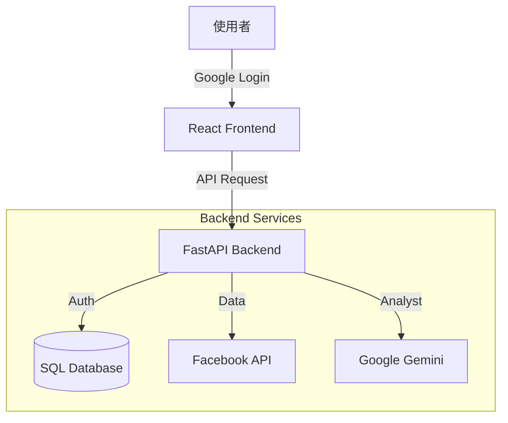

# 技術規格與效能優化 (Specifications & Optimization)

本文件詳述專案的技術細節、系統架構以及已完成的重大優化。

---

## 🛠️ 技術棧 (Tech Stack)

### 前端 (Frontend)
- **框架**: React 19 + Vite 7
- **圖表**: Recharts (支援雙軸趨勢圖)
- **認證**: @react-oauth/google
- **樣式**: CSS Modules (Glassmorphism 風格)

### 後端 (Backend)
- **框架**: FastAPI (Python 3.9+)
- **ORM**: SQLAlchemy + Alembic
- **資料庫**: SQLite (本地) / PostgreSQL (正式)
- **AI**: Google Gemini (診斷助理)
- **加密**: Fernet 對稱式加密 (用於 Access Tokens)

---

## 📐 系統架構

---

## 📈 效能優化紀錄 (Optimization History)

本專案於 2025-12-17 進行了重大優化：

### 1. 後端效能
- **✅ 非同步處理**: 改用 `httpx.AsyncClient` 實作非同步 API 呼叫，`asyncio.gather` 並行抓取數據。
- **✅ 快取機制**: 引入 `cachetools` 實作 Memory Cache，減少重複呼叫 Facebook API。
- **✅ 批次請求**: 整合 Facebook Batch API，將多個請求合併為一個往返。

### 2. 前端效能
- **✅ 程式碼分割**: 使用 `React.lazy()` 實作頁面層級的 Code Splitting。
- **✅ 元件記憶化**: 導入 `React.memo`, `useMemo`, `useCallback` 優化重渲染。
- **✅ 模組化拆分**: 將龐大的 `Analytics.jsx` 拆分為多個子元件與自訂 Hooks。

### 3. 使用者體驗 (UX)
- **✅ 骨架屏 (Skeleton)**: 優化載入狀態顯示。
- **✅ 樂觀更新 (Optimistic)**: 團隊成員管理等操作先更新 UI 再發送請求。
- **✅ 錯誤邊界 (Error Boundary)**: 防止單一元件崩潰導致整頁失效。

---

## 📊 核心指標 (Metrics)
支援 General (基礎), E-commerce (電商), Funnel (漏斗), CPAS (協作廣告), Engagement (互動), Diagnosis (品質診斷) 等多維度數據。
