# 🌌 Meta Andromeda 系統架構與流程說明書

本指南詳細說明 **Meta Andromeda** 模組中「手動上傳素材評分」與「抓取廣告成效數據」兩大核心流程的運作機制、模型預測與校準（訓練）方式，以及兩者之間的閉環關聯性。

---

## 🏗️ 核心定位：Pre-launch 預估與 Post-launch 實測的閉環整合

Meta Andromeda 是一個結合 **「大語言/多模態模型 (Gemini)」** 與 **「線上廣告實測反饋」** 的智慧型廣告評估系統。其設計宗旨是在廣告上線前過濾劣質創意，並在廣告上線後藉由真實成效數據對預估模型進行持續監控與校準。

```mermaid
graph TD
    %% 流程 A：Pre-launch 評分
    subgraph Pre-launch_Score_Lab ["【評分工作台】Pre-launch 預估推論"]
        A1["手動上傳素材 (圖片/影片)"] --> A2["輸入廣告文字中繼資料 (Headline/CTA等)"]
        A2 --> A3["建立評分事件 (Score Event)"]
        A3 --> A4["推入任務佇列 (Queue)"]
        A4 --> A5["Gemini 多模態評分 Runtime"]
        A5 --> A6["產出預先評估結果 (分數/正負向驅動因素)"]
    end

    %% 流程 B：Post-launch 數據抓取
    subgraph Post-launch_Monitoring ["【監控與數據抓取】Post-launch 實測反饋"]
        B1["抓取 Facebook 廣告實測數據 (曝光/點擊/轉換/ROAS)"] --> B2["同步校準資料集 (Observed Records)"]
        B2 --> B3["比對 (先前預估值 vs. 線上真實值)"]
        B3 --> B4["計算模型漂移檢測 (Drift Detection)"]
    end

    %% 關聯與閉環
    B4 -- "檢測出顯著漂移 (Drifted)" --> C1["版本發佈自動鎖定 (防止預測品質下滑)"]
    B2 -- "打包校準數據集 (Calibration Dataset)" --> C2["模型微調與權限重校準 (Fine-tuning / Alignment)"]
    C2 -.-> A5

    style Pre-launch_Score_Lab fill:#1e1e2e,stroke:#3b82f6,stroke-width:2px;
    style Post-launch_Monitoring fill:#181825,stroke:#10b981,stroke-width:2px;
    style C1 fill:#ef4444,stroke:#fff,stroke-width:1px;
    style C2 fill:#f59e0b,stroke:#fff,stroke-width:1px;
```

---

## 1. 兩大流程深度對照

| 比較維度 | 流程 A：手動上傳素材 (評分工作台) | 流程 B：抓取廣告數據 (FB Ads Importer) |
| :--- | :--- | :--- |
| **所屬階段** | **上線前預估 (Pre-launch Prediction)** | **上線後實測 (Post-launch Performance)** |
| **主要輸入** | 廣告原始素材 (Image/Video) + 廣告文案 (Headline/Primary Text/CTA) | 來自 Facebook Graph API 的廣告成效指標 (Spend, Impressions, Conversions, ROAS) |
| **處理核心** | Gemini 1.5 Pro/Flash 多模態模型 或 Heuristic 評估程序 | 數據正規化引擎 (Facebook Ads Importer) |
| **資料庫記錄** | `meta_andromeda_score_events` (評分事件) | `meta_andromeda_observed_records` (觀察紀錄/實測結果) |
| **核心目的** | 在廣告投放前評估創意品質，預先篩選出高勝率的素材。 | 收集「真實世界數據 (Ground Truth)」作為模型成效的核對依據。 |

---

## 2. 模型預測與訓練/校準機制

### 💡 手動上傳素材 ── 如何透過模型進行「預測」？
當使用者在評分工作台點擊送出時，系統將執行 **零樣本/少樣本先驗推論 (Prior Inference)**：
1. **多模態特徵提取**：Gemini 多模態模型同時讀取廣告圖片/影片（影像特徵）與 Headline/Primary Text（文字特徵）。
2. **脈絡分析 (Contextual Reasoning)**：模型根據您輸入的 `行銷目標 (Objective)`、`版位系列 (Placement Family)` 與 `目標市場 (Market)` 等參數，對素材進行客製化評估。
3. **評估產出**：模型預測出此創意的預估點擊率/轉換率區間，回傳總評分（`overall_score`）與定性診斷說明（正負向驅動因素、風險標籤等）。

### 🧪 抓取廣告成效 ── 如何透過數據進行「訓練或校準」？
線上廣告實測成效是系統的 **真實標籤 (Ground Truth)**。抓取這些數據後，模型校準分為以下層次：
1. **資料校準集打包 (Calibration Dataset)**：
   實測數據會被記錄在 `observed_records` 中。管理員可以使用「同步校正資料集」功能，將預估特徵與真實表現進行對齊打包（例如：*模型預估有 Clear CTA 給高分，但實測轉化卻極低*）。這份打包數據可供微調 (Fine-tuning) LLM，讓模型修正偏見。
2. **安全發佈閘門設定 (Promotion Gates)**：
   實測數據會決定目前的線上模型版本是否足夠穩定。如果實測結果大於設定的門檻（如 `accuracy_gate > 60%`），代表模型判斷精準，允許新版本發佈；反之則代表模型預估失靈。

---

## 3. 抓取廣告數據對「手動上傳評分模型」的關聯性

> [!IMPORTANT]
> **抓取實測廣告數據，是維護手動上傳評分模型「預測生命力」的靈魂來源。兩者屬於互為因果的閉環主動學習（Active Learning）關係。**

這兩者之間的關聯主要體現在以下三個維度：

### 🛑 關聯一：漂移鎖定機制 (Drift Lock) ── 防止錯誤預估擴大
* **運作邏輯**：系統會自動對照「手動評分時預估的分數」與「抓取回來的實測成效（ROAS / 轉換率）」。如果發現模型的預估準確率下滑至低於安全門檻，系統會將漂移狀態判定為 `drifted` (嚴重漂移)。
* **連鎖反應**：一旦偵測出嚴重漂移，系統會**自動鎖定**版本總覽中的新模型發佈按鈕。這是為了解決模型「概念漂移 (Concept Drift)」── 當市場喜好或廣告演算法改變，模型以前認為的好素材現在可能失效。此時必須先對模型進行校準，才能繼續發佈。

### 🔄 關聯二：主動學習閉環 (Active Learning Loop) ── 讓預估模型越用越聰明
如果僅有手動上傳評分，模型將永遠維持在初始的認知狀態。
* 藉由定期抓取線上實測數據，系統可以不斷收集**「被預測偏高但實測很差」**或**「被預測偏低但實測極佳」**的極端素材。
* 這些被標註「實測結果」的素材，將被作為最珍貴的「硬樣本 (Hard Examples)」用來微調模型，這使得下一次您手動上傳素材評分時，模型的評分標準能與最新的市場趨勢精準契合。

### 🎯 關聯三：評估閾值動態調整 (Threshold Dynamic Tuning)
* 後端評估引擎在判斷 `overall_score` 的等級時，需要知道「市場的平均基準線」。
* 抓取的廣告數據提供了當前市場（例如：台灣市場 TW、導購目標 purchase）的最新平均點擊率、轉換率等實測指標，這能動態校準 Heuristic 模擬評分中的計算參數，讓手動評分的分數更具參考價值。
